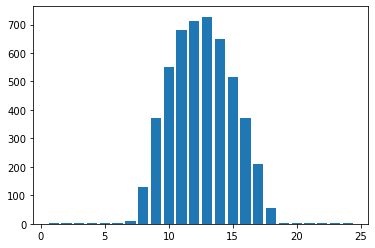
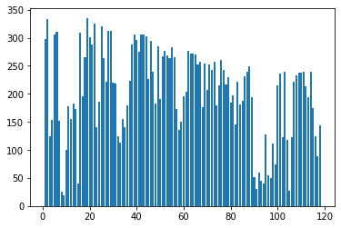
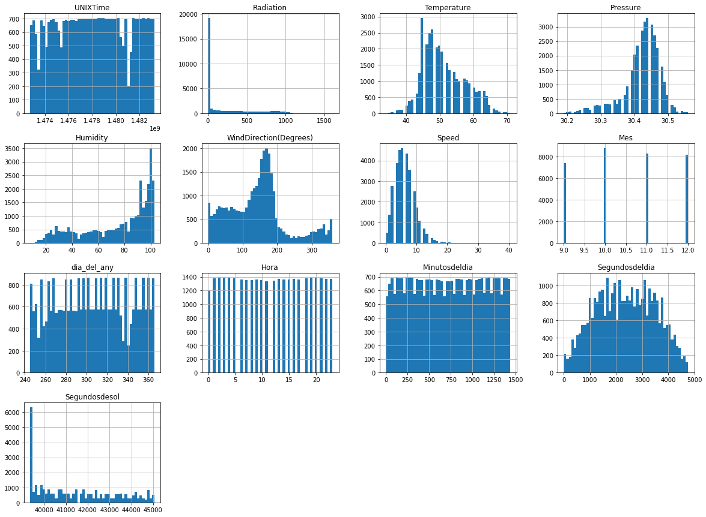
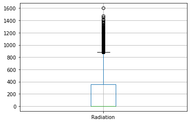
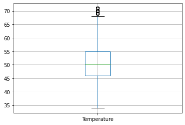
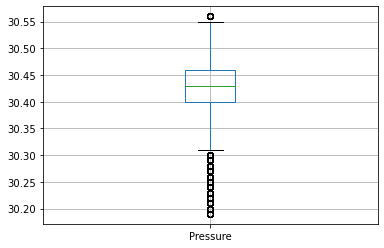
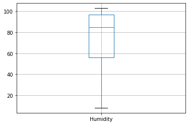
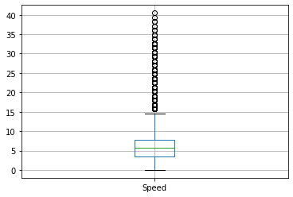
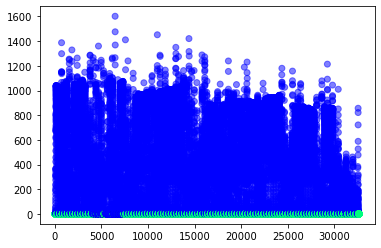
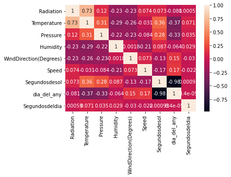

# Solar Radiation Prediction
### Task from NASA Hackathon

by: Isart Gaspà

El Objetivo de la práctica es predecir la Radiación solar con los datos obtenidos de la Nasa en Hawaii. La tabla de datos contiene datos cada 5 minutos para los meses de setiembre a diciembre de 2016.

Caragar las librerias


```python
import numpy as np
import pandas as pd
import os
import pickle
import matplotlib
import matplotlib.pyplot as plt
import seaborn as sn
from scipy import stats
from datetime import datetime
from pytz import timezone
import pytz
```

Cargar el dataset


```python
dataset = pd.read_csv("SolarPrediction.csv")
dataset.head()
```


<div>
<style scoped>
    .dataframe tbody tr th:only-of-type {
        vertical-align: middle;
    }

    .dataframe tbody tr th {
        vertical-align: top;
    }

    .dataframe thead th {
        text-align: right;
    }
</style>
<table border="1" class="dataframe">
  <thead>
    <tr style="text-align: right;">
      <th></th>
      <th>UNIXTime</th>
      <th>Data</th>
      <th>Time</th>
      <th>Radiation</th>
      <th>Temperature</th>
      <th>Pressure</th>
      <th>Humidity</th>
      <th>WindDirection(Degrees)</th>
      <th>Speed</th>
      <th>TimeSunRise</th>
      <th>TimeSunSet</th>
    </tr>
  </thead>
  <tbody>
    <tr>
      <th>0</th>
      <td>1475229326</td>
      <td>9/29/2016 12:00:00 AM</td>
      <td>23:55:26</td>
      <td>1.21</td>
      <td>48</td>
      <td>30.46</td>
      <td>59</td>
      <td>177.39</td>
      <td>5.62</td>
      <td>06:13:00</td>
      <td>18:13:00</td>
    </tr>
    <tr>
      <th>1</th>
      <td>1475229023</td>
      <td>9/29/2016 12:00:00 AM</td>
      <td>23:50:23</td>
      <td>1.21</td>
      <td>48</td>
      <td>30.46</td>
      <td>58</td>
      <td>176.78</td>
      <td>3.37</td>
      <td>06:13:00</td>
      <td>18:13:00</td>
    </tr>
    <tr>
      <th>2</th>
      <td>1475228726</td>
      <td>9/29/2016 12:00:00 AM</td>
      <td>23:45:26</td>
      <td>1.23</td>
      <td>48</td>
      <td>30.46</td>
      <td>57</td>
      <td>158.75</td>
      <td>3.37</td>
      <td>06:13:00</td>
      <td>18:13:00</td>
    </tr>
    <tr>
      <th>3</th>
      <td>1475228421</td>
      <td>9/29/2016 12:00:00 AM</td>
      <td>23:40:21</td>
      <td>1.21</td>
      <td>48</td>
      <td>30.46</td>
      <td>60</td>
      <td>137.71</td>
      <td>3.37</td>
      <td>06:13:00</td>
      <td>18:13:00</td>
    </tr>
    <tr>
      <th>4</th>
      <td>1475228124</td>
      <td>9/29/2016 12:00:00 AM</td>
      <td>23:35:24</td>
      <td>1.17</td>
      <td>48</td>
      <td>30.46</td>
      <td>62</td>
      <td>104.95</td>
      <td>5.62</td>
      <td>06:13:00</td>
      <td>18:13:00</td>
    </tr>
  </tbody>
</table>
</div>


```python
dataset.info()
```

    <class 'pandas.core.frame.DataFrame'>
    RangeIndex: 32686 entries, 0 to 32685
    Data columns (total 11 columns):
     #   Column                  Non-Null Count  Dtype  
    ---  ------                  --------------  -----  
     0   UNIXTime                32686 non-null  int64  
     1   Data                    32686 non-null  object 
     2   Time                    32686 non-null  object 
     3   Radiation               32686 non-null  float64
     4   Temperature             32686 non-null  int64  
     5   Pressure                32686 non-null  float64
     6   Humidity                32686 non-null  int64  
     7   WindDirection(Degrees)  32686 non-null  float64
     8   Speed                   32686 non-null  float64
     9   TimeSunRise             32686 non-null  object 
     10  TimeSunSet              32686 non-null  object 
    dtypes: float64(4), int64(3), object(4)
    memory usage: 2.7+ MB
    

Hay un total de 32.686 filas en nuestro Dataset

Observamos que no tenemos valor nulos en ninguna de las 10 columnas


```python
dataset[dataset.duplicated(keep="first")]
```


<div>
<style scoped>
    .dataframe tbody tr th:only-of-type {
        vertical-align: middle;
    }

    .dataframe tbody tr th {
        vertical-align: top;
    }

    .dataframe thead th {
        text-align: right;
    }
</style>
<table border="1" class="dataframe">
  <thead>
    <tr style="text-align: right;">
      <th></th>
      <th>UNIXTime</th>
      <th>Data</th>
      <th>Time</th>
      <th>Radiation</th>
      <th>Temperature</th>
      <th>Pressure</th>
      <th>Humidity</th>
      <th>WindDirection(Degrees)</th>
      <th>Speed</th>
      <th>TimeSunRise</th>
      <th>TimeSunSet</th>
    </tr>
  </thead>
  <tbody>
  </tbody>
</table>
</div>


No existen duplicados tampoco

Tal como se observa en el dataset, las features tienen unas mediciones cada 5 minutos. Lo que nos implica una serie de transformaciones en las features data y time para poder trabajar con ellas.


```python
#Localización
hawaii= timezone('Pacific/Honolulu')
dataset.index =  pd.to_datetime(dataset['UNIXTime'], unit='s')
dataset.index = dataset.index.tz_localize(pytz.utc).tz_convert(hawaii)

#Mes, Dia del Año
dataset["Mes"]=dataset.index.strftime("%m").astype(int)
dataset["dia_del_any"]=dataset.index.strftime("%j").astype(int)

#Hora, minutos y segundos del dia
dataset["Hora"]=dataset.index.hour
dataset["Minutosdeldia"]=dataset.index.hour*60+dataset.index.minute
dataset["Segundosdeldia"]=dataset.index.hour*60+dataset.index.minute*60+dataset.index.second

#transformamos las variables objeto en datos de Datetime y calculamos el timpo de sol durante el dia en una nueva variable
dataset["TimeSunRise"]=pd.to_datetime(dataset["TimeSunRise"])
dataset["TimeSunSet"]=pd.to_datetime(dataset["TimeSunSet"])
dataset["Segundosdesol"]=dataset["TimeSunSet"]-dataset["TimeSunRise"]
dataset["Segundosdesol"]=dataset["Segundosdesol"].dt.total_seconds()

#limieza de fetarues ya usadas
dataset.drop(["Data", "Time","TimeSunRise", "TimeSunSet"], inplace=True, axis=1)
dataset
```


<div>
<style scoped>
    .dataframe tbody tr th:only-of-type {
        vertical-align: middle;
    }

    .dataframe tbody tr th {
        vertical-align: top;
    }

    .dataframe thead th {
        text-align: right;
    }
</style>
<table border="1" class="dataframe">
  <thead>
    <tr style="text-align: right;">
      <th></th>
      <th>UNIXTime</th>
      <th>Radiation</th>
      <th>Temperature</th>
      <th>Pressure</th>
      <th>Humidity</th>
      <th>WindDirection(Degrees)</th>
      <th>Speed</th>
      <th>Mes</th>
      <th>dia_del_any</th>
      <th>Hora</th>
      <th>Minutosdeldia</th>
      <th>Segundosdeldia</th>
      <th>Segundosdesol</th>
    </tr>
    <tr>
      <th>UNIXTime</th>
      <th></th>
      <th></th>
      <th></th>
      <th></th>
      <th></th>
      <th></th>
      <th></th>
      <th></th>
      <th></th>
      <th></th>
      <th></th>
      <th></th>
      <th></th>
    </tr>
  </thead>
  <tbody>
    <tr>
      <th>2016-09-29 23:55:26-10:00</th>
      <td>1475229326</td>
      <td>1.21</td>
      <td>48</td>
      <td>30.46</td>
      <td>59</td>
      <td>177.39</td>
      <td>5.62</td>
      <td>9</td>
      <td>273</td>
      <td>23</td>
      <td>1435</td>
      <td>4706</td>
      <td>43200.0</td>
    </tr>
    <tr>
      <th>2016-09-29 23:50:23-10:00</th>
      <td>1475229023</td>
      <td>1.21</td>
      <td>48</td>
      <td>30.46</td>
      <td>58</td>
      <td>176.78</td>
      <td>3.37</td>
      <td>9</td>
      <td>273</td>
      <td>23</td>
      <td>1430</td>
      <td>4403</td>
      <td>43200.0</td>
    </tr>
    <tr>
      <th>2016-09-29 23:45:26-10:00</th>
      <td>1475228726</td>
      <td>1.23</td>
      <td>48</td>
      <td>30.46</td>
      <td>57</td>
      <td>158.75</td>
      <td>3.37</td>
      <td>9</td>
      <td>273</td>
      <td>23</td>
      <td>1425</td>
      <td>4106</td>
      <td>43200.0</td>
    </tr>
    <tr>
      <th>2016-09-29 23:40:21-10:00</th>
      <td>1475228421</td>
      <td>1.21</td>
      <td>48</td>
      <td>30.46</td>
      <td>60</td>
      <td>137.71</td>
      <td>3.37</td>
      <td>9</td>
      <td>273</td>
      <td>23</td>
      <td>1420</td>
      <td>3801</td>
      <td>43200.0</td>
    </tr>
    <tr>
      <th>2016-09-29 23:35:24-10:00</th>
      <td>1475228124</td>
      <td>1.17</td>
      <td>48</td>
      <td>30.46</td>
      <td>62</td>
      <td>104.95</td>
      <td>5.62</td>
      <td>9</td>
      <td>273</td>
      <td>23</td>
      <td>1415</td>
      <td>3504</td>
      <td>43200.0</td>
    </tr>
    <tr>
      <th>...</th>
      <td>...</td>
      <td>...</td>
      <td>...</td>
      <td>...</td>
      <td>...</td>
      <td>...</td>
      <td>...</td>
      <td>...</td>
      <td>...</td>
      <td>...</td>
      <td>...</td>
      <td>...</td>
      <td>...</td>
    </tr>
    <tr>
      <th>2016-12-01 00:20:04-10:00</th>
      <td>1480587604</td>
      <td>1.22</td>
      <td>44</td>
      <td>30.43</td>
      <td>102</td>
      <td>145.42</td>
      <td>6.75</td>
      <td>12</td>
      <td>336</td>
      <td>0</td>
      <td>20</td>
      <td>1204</td>
      <td>39660.0</td>
    </tr>
    <tr>
      <th>2016-12-01 00:15:01-10:00</th>
      <td>1480587301</td>
      <td>1.17</td>
      <td>44</td>
      <td>30.42</td>
      <td>102</td>
      <td>117.78</td>
      <td>6.75</td>
      <td>12</td>
      <td>336</td>
      <td>0</td>
      <td>15</td>
      <td>901</td>
      <td>39660.0</td>
    </tr>
    <tr>
      <th>2016-12-01 00:10:01-10:00</th>
      <td>1480587001</td>
      <td>1.20</td>
      <td>44</td>
      <td>30.42</td>
      <td>102</td>
      <td>145.19</td>
      <td>9.00</td>
      <td>12</td>
      <td>336</td>
      <td>0</td>
      <td>10</td>
      <td>601</td>
      <td>39660.0</td>
    </tr>
    <tr>
      <th>2016-12-01 00:05:02-10:00</th>
      <td>1480586702</td>
      <td>1.23</td>
      <td>44</td>
      <td>30.42</td>
      <td>101</td>
      <td>164.19</td>
      <td>7.87</td>
      <td>12</td>
      <td>336</td>
      <td>0</td>
      <td>5</td>
      <td>302</td>
      <td>39660.0</td>
    </tr>
    <tr>
      <th>2016-12-01 00:00:02-10:00</th>
      <td>1480586402</td>
      <td>1.20</td>
      <td>44</td>
      <td>30.43</td>
      <td>101</td>
      <td>83.59</td>
      <td>3.37</td>
      <td>12</td>
      <td>336</td>
      <td>0</td>
      <td>0</td>
      <td>2</td>
      <td>39660.0</td>
    </tr>
  </tbody>
</table>
<p>32686 rows × 13 columns</p>
</div>


```python
#agrupamos por días para obtener el promedio de radiación
```


```python
mediadelahora=dataset.groupby("Hora").mean()
type(mediadelahora)
mediadelahora.head()
```


<div>
<style scoped>
    .dataframe tbody tr th:only-of-type {
        vertical-align: middle;
    }

    .dataframe tbody tr th {
        vertical-align: top;
    }

    .dataframe thead th {
        text-align: right;
    }
</style>
<table border="1" class="dataframe">
  <thead>
    <tr style="text-align: right;">
      <th></th>
      <th>UNIXTime</th>
      <th>Radiation</th>
      <th>Temperature</th>
      <th>Pressure</th>
      <th>Humidity</th>
      <th>WindDirection(Degrees)</th>
      <th>Speed</th>
      <th>Mes</th>
      <th>dia_del_any</th>
      <th>Minutosdeldia</th>
      <th>Segundosdeldia</th>
      <th>Segundosdesol</th>
    </tr>
    <tr>
      <th>Hora</th>
      <th></th>
      <th></th>
      <th></th>
      <th></th>
      <th></th>
      <th></th>
      <th></th>
      <th></th>
      <th></th>
      <th></th>
      <th></th>
      <th></th>
    </tr>
  </thead>
  <tbody>
    <tr>
      <th>0</th>
      <td>1.478336e+09</td>
      <td>1.317216</td>
      <td>46.878210</td>
      <td>30.429246</td>
      <td>75.277548</td>
      <td>162.447067</td>
      <td>6.144383</td>
      <td>10.633803</td>
      <td>309.937862</td>
      <td>28.641259</td>
      <td>1736.207125</td>
      <td>41227.009114</td>
    </tr>
    <tr>
      <th>1</th>
      <td>1.477931e+09</td>
      <td>1.381874</td>
      <td>46.709117</td>
      <td>30.419855</td>
      <td>75.758321</td>
      <td>163.667323</td>
      <td>6.365810</td>
      <td>10.500724</td>
      <td>305.210564</td>
      <td>87.608538</td>
      <td>1734.121563</td>
      <td>41484.659913</td>
    </tr>
    <tr>
      <th>2</th>
      <td>1.477931e+09</td>
      <td>1.385730</td>
      <td>46.305636</td>
      <td>30.408569</td>
      <td>74.004335</td>
      <td>163.823873</td>
      <td>6.269538</td>
      <td>10.497110</td>
      <td>305.159682</td>
      <td>147.523121</td>
      <td>1788.641618</td>
      <td>41487.355491</td>
    </tr>
    <tr>
      <th>3</th>
      <td>1.477937e+09</td>
      <td>1.365340</td>
      <td>46.125723</td>
      <td>30.401272</td>
      <td>73.711705</td>
      <td>163.899364</td>
      <td>6.473634</td>
      <td>10.497832</td>
      <td>305.187861</td>
      <td>207.540462</td>
      <td>1850.117052</td>
      <td>41485.534682</td>
    </tr>
    <tr>
      <th>4</th>
      <td>1.477922e+09</td>
      <td>1.363999</td>
      <td>45.917147</td>
      <td>30.401448</td>
      <td>73.359510</td>
      <td>167.301405</td>
      <td>6.701275</td>
      <td>10.492075</td>
      <td>304.971902</td>
      <td>267.538184</td>
      <td>1909.690922</td>
      <td>41497.305476</td>
    </tr>
  </tbody>
</table>
</div>


```python
r=list(mediadelahora["Radiation"])
index=np.arange(1,25,1)
```


```python
plt.bar(index, r)
```


    <BarContainer object of 24 artists>


    

    


La máxima radiación corresponde con el mediodía tal como era de suponer


```python
mediadeldia=dataset.groupby("dia_del_any").mean()
rdia=list(mediadeldia["Radiation"])
indexdias=np.arange(1,119,1)
```


```python
plt.bar(indexdias, rdia)
```


    <BarContainer object of 118 artists>


    

    


```python
#Obseravmos las features gráficamente
dataset.hist(bins=50, figsize=(20,15))
```


    array([[<AxesSubplot:title={'center':'UNIXTime'}>,
            <AxesSubplot:title={'center':'Radiation'}>,
            <AxesSubplot:title={'center':'Temperature'}>,
            <AxesSubplot:title={'center':'Pressure'}>],
           [<AxesSubplot:title={'center':'Humidity'}>,
            <AxesSubplot:title={'center':'WindDirection(Degrees)'}>,
            <AxesSubplot:title={'center':'Speed'}>,
            <AxesSubplot:title={'center':'Mes'}>],
           [<AxesSubplot:title={'center':'dia_del_any'}>,
            <AxesSubplot:title={'center':'Hora'}>,
            <AxesSubplot:title={'center':'Minutosdeldia'}>,
            <AxesSubplot:title={'center':'Segundosdeldia'}>],
           [<AxesSubplot:title={'center':'Segundosdesol'}>, <AxesSubplot:>,
            <AxesSubplot:>, <AxesSubplot:>]], dtype=object)


    

    


A partir de los histogramas podemos obervar algunas anomalias:
- La radiación tiene una serie de datos muy por encima del resto de datos, son los datos de las horas de la noche donde no hay radiación
- La temperatura en Farenheid, tiene una distribución que se parece a una normal con desviación a la derecha, una asimemtria positiva, lo mismo ocurre con la velocidad del viento.
- La presión muestra una asimetria a la izquierda y por tanto negativa, lo mismo ocurre pero de forma más pronunciada en la humedad.


```python
dataset.describe() #valores estadísticos
```


<div>
<style scoped>
    .dataframe tbody tr th:only-of-type {
        vertical-align: middle;
    }

    .dataframe tbody tr th {
        vertical-align: top;
    }

    .dataframe thead th {
        text-align: right;
    }
</style>
<table border="1" class="dataframe">
  <thead>
    <tr style="text-align: right;">
      <th></th>
      <th>UNIXTime</th>
      <th>Radiation</th>
      <th>Temperature</th>
      <th>Pressure</th>
      <th>Humidity</th>
      <th>WindDirection(Degrees)</th>
      <th>Speed</th>
      <th>Mes</th>
      <th>dia_del_any</th>
      <th>Hora</th>
      <th>Minutosdeldia</th>
      <th>Segundosdeldia</th>
      <th>Segundosdesol</th>
    </tr>
  </thead>
  <tbody>
    <tr>
      <th>count</th>
      <td>3.268600e+04</td>
      <td>32686.000000</td>
      <td>32686.000000</td>
      <td>32686.000000</td>
      <td>32686.000000</td>
      <td>32686.000000</td>
      <td>32686.000000</td>
      <td>32686.000000</td>
      <td>32686.000000</td>
      <td>32686.000000</td>
      <td>32686.000000</td>
      <td>32686.000000</td>
      <td>32686.000000</td>
    </tr>
    <tr>
      <th>mean</th>
      <td>1.478047e+09</td>
      <td>207.124697</td>
      <td>51.103255</td>
      <td>30.422879</td>
      <td>75.016307</td>
      <td>143.489821</td>
      <td>6.243869</td>
      <td>10.526066</td>
      <td>306.110965</td>
      <td>11.557425</td>
      <td>721.002203</td>
      <td>2364.288870</td>
      <td>41433.032491</td>
    </tr>
    <tr>
      <th>std</th>
      <td>3.005037e+06</td>
      <td>315.916387</td>
      <td>6.201157</td>
      <td>0.054673</td>
      <td>25.990219</td>
      <td>83.167500</td>
      <td>3.490474</td>
      <td>1.096691</td>
      <td>34.781367</td>
      <td>6.912034</td>
      <td>415.011513</td>
      <td>1114.592999</td>
      <td>1795.873502</td>
    </tr>
    <tr>
      <th>min</th>
      <td>1.472724e+09</td>
      <td>1.110000</td>
      <td>34.000000</td>
      <td>30.190000</td>
      <td>8.000000</td>
      <td>0.090000</td>
      <td>0.000000</td>
      <td>9.000000</td>
      <td>245.000000</td>
      <td>0.000000</td>
      <td>0.000000</td>
      <td>1.000000</td>
      <td>39360.000000</td>
    </tr>
    <tr>
      <th>25%</th>
      <td>1.475546e+09</td>
      <td>1.230000</td>
      <td>46.000000</td>
      <td>30.400000</td>
      <td>56.000000</td>
      <td>82.227500</td>
      <td>3.370000</td>
      <td>10.000000</td>
      <td>277.000000</td>
      <td>6.000000</td>
      <td>360.000000</td>
      <td>1461.000000</td>
      <td>39720.000000</td>
    </tr>
    <tr>
      <th>50%</th>
      <td>1.478026e+09</td>
      <td>2.660000</td>
      <td>50.000000</td>
      <td>30.430000</td>
      <td>85.000000</td>
      <td>147.700000</td>
      <td>5.620000</td>
      <td>11.000000</td>
      <td>306.000000</td>
      <td>12.000000</td>
      <td>720.000000</td>
      <td>2360.000000</td>
      <td>41040.000000</td>
    </tr>
    <tr>
      <th>75%</th>
      <td>1.480480e+09</td>
      <td>354.235000</td>
      <td>55.000000</td>
      <td>30.460000</td>
      <td>97.000000</td>
      <td>179.310000</td>
      <td>7.870000</td>
      <td>11.000000</td>
      <td>334.000000</td>
      <td>18.000000</td>
      <td>1080.000000</td>
      <td>3259.750000</td>
      <td>42900.000000</td>
    </tr>
    <tr>
      <th>max</th>
      <td>1.483265e+09</td>
      <td>1601.260000</td>
      <td>71.000000</td>
      <td>30.560000</td>
      <td>103.000000</td>
      <td>359.950000</td>
      <td>40.500000</td>
      <td>12.000000</td>
      <td>366.000000</td>
      <td>23.000000</td>
      <td>1436.000000</td>
      <td>4765.000000</td>
      <td>45060.000000</td>
    </tr>
  </tbody>
</table>
</div>


```python
#mediana
dataset.median(axis=0)
```


    UNIXTime                  1.478026e+09
    Radiation                 2.660000e+00
    Temperature               5.000000e+01
    Pressure                  3.043000e+01
    Humidity                  8.500000e+01
    WindDirection(Degrees)    1.477000e+02
    Speed                     5.620000e+00
    Mes                       1.100000e+01
    dia_del_any               3.060000e+02
    Hora                      1.200000e+01
    Minutosdeldia             7.200000e+02
    Segundosdeldia            2.360000e+03
    Segundosdesol             4.104000e+04
    dtype: float64


Tal como se obervaba en los histogramas, la media es superior a la mediana en temperatura y dirección de viento. También se observa la media superior a la mediana en la presión, a diferencia de lo que parecia en el histogrma. En cambio es inferior en Humedad.

La varianza es muy elevada en la Radiación, pero tiene la explicación de que se siguien tomando los datos durante la noche.


```python
#Visualización de los histogramas con Pandas
boxplot_r = dataset.boxplot(column=["Radiation"])
```


    

    


```python
boxplot_t = dataset.boxplot(column=["Temperature"])
```


    

    


```python
boxplot_p = dataset.boxplot(column=["Pressure"])
```


    

    


```python
boxplot_p = dataset.boxplot(column=["Humidity"])
```


    

    


```python
boxplot_p = dataset.boxplot(column=["Speed"])
```


    

    


Se considera que la velocidad del viento puede ser alta en días puntuales.

Estudiamos si los valores de radiación son descritocs como Outliers
Análisis de valores extremos (Extreme Value Analysis)


```python
# Calculamos el rango intercuartílico
IQR = dataset["Radiation"].quantile(0.75) - dataset["Radiation"].quantile(0.25)
```


```python
# Calculamos el límite superior (normal y extremo)
limSup = dataset["Radiation"].quantile(0.75) + (IQR *  1.5)
limSupExt = dataset["Radiation"].quantile(0.75) + (IQR *  3)
```


```python
#Vamos a ver la proporción de observaciones que se encuentra por encima de estos límites:
total = dataset["Radiation"].shape[0]
```


```python
# Examinamos el límite superior
len(dataset[dataset["Radiation"] > limSup])/total
```


    0.06011748149054641


un 6% de las observaciones está por encima del límite superior extremo


```python
# Calculámos el límite inferior (normal y extremo)
limInf = dataset["Radiation"].quantile(0.25) - (IQR *  1.5)
limInfExt = dataset["Radiation"].quantile(0.25) - (IQR *  3)
```


```python
# Examinamos el límite inferior
len(dataset[dataset["Radiation"] < limInf])/total
```


    0.0


El 0% nos indica que no son valores anomalos extremos, sino que hay muchos horas sin radiación


```python
#Calculo de Z-Score
z = stats.zscore(dataset["Radiation"])
print("max: ",z.max(), "Min :", z.min())
z
```

    max:  4.413055750692607 Min : -0.6521277694597974
    


    array([-0.65181123, -0.65181123, -0.65174792, ..., -0.65184288,
           -0.65174792, -0.65184288])


```python
# Un gráfico de dispersión a veces nos da perspectiva de nuestros posibles outliers
plt.scatter(np.arange(len(dataset)), dataset["Radiation"], c=z<-0.65, cmap=plt.get_cmap("winter"), alpha=0.5)
```


    <matplotlib.collections.PathCollection at 0x22505cbbbe0>


    

    


No se consideramos los valores como Outliers, por lo tanto siguimos estudiando el dataset


```python
#nos quedamos con las variables utiles
dataset2=dataset[["Radiation","Temperature","Pressure","Humidity","WindDirection(Degrees)","Speed","Segundosdesol", "dia_del_any","Segundosdeldia"]]
dataset2
```


<div>
<style scoped>
    .dataframe tbody tr th:only-of-type {
        vertical-align: middle;
    }

    .dataframe tbody tr th {
        vertical-align: top;
    }

    .dataframe thead th {
        text-align: right;
    }
</style>
<table border="1" class="dataframe">
  <thead>
    <tr style="text-align: right;">
      <th></th>
      <th>Radiation</th>
      <th>Temperature</th>
      <th>Pressure</th>
      <th>Humidity</th>
      <th>WindDirection(Degrees)</th>
      <th>Speed</th>
      <th>Segundosdesol</th>
      <th>dia_del_any</th>
      <th>Segundosdeldia</th>
    </tr>
    <tr>
      <th>UNIXTime</th>
      <th></th>
      <th></th>
      <th></th>
      <th></th>
      <th></th>
      <th></th>
      <th></th>
      <th></th>
      <th></th>
    </tr>
  </thead>
  <tbody>
    <tr>
      <th>2016-09-29 23:55:26-10:00</th>
      <td>1.21</td>
      <td>48</td>
      <td>30.46</td>
      <td>59</td>
      <td>177.39</td>
      <td>5.62</td>
      <td>43200.0</td>
      <td>273</td>
      <td>4706</td>
    </tr>
    <tr>
      <th>2016-09-29 23:50:23-10:00</th>
      <td>1.21</td>
      <td>48</td>
      <td>30.46</td>
      <td>58</td>
      <td>176.78</td>
      <td>3.37</td>
      <td>43200.0</td>
      <td>273</td>
      <td>4403</td>
    </tr>
    <tr>
      <th>2016-09-29 23:45:26-10:00</th>
      <td>1.23</td>
      <td>48</td>
      <td>30.46</td>
      <td>57</td>
      <td>158.75</td>
      <td>3.37</td>
      <td>43200.0</td>
      <td>273</td>
      <td>4106</td>
    </tr>
    <tr>
      <th>2016-09-29 23:40:21-10:00</th>
      <td>1.21</td>
      <td>48</td>
      <td>30.46</td>
      <td>60</td>
      <td>137.71</td>
      <td>3.37</td>
      <td>43200.0</td>
      <td>273</td>
      <td>3801</td>
    </tr>
    <tr>
      <th>2016-09-29 23:35:24-10:00</th>
      <td>1.17</td>
      <td>48</td>
      <td>30.46</td>
      <td>62</td>
      <td>104.95</td>
      <td>5.62</td>
      <td>43200.0</td>
      <td>273</td>
      <td>3504</td>
    </tr>
    <tr>
      <th>...</th>
      <td>...</td>
      <td>...</td>
      <td>...</td>
      <td>...</td>
      <td>...</td>
      <td>...</td>
      <td>...</td>
      <td>...</td>
      <td>...</td>
    </tr>
    <tr>
      <th>2016-12-01 00:20:04-10:00</th>
      <td>1.22</td>
      <td>44</td>
      <td>30.43</td>
      <td>102</td>
      <td>145.42</td>
      <td>6.75</td>
      <td>39660.0</td>
      <td>336</td>
      <td>1204</td>
    </tr>
    <tr>
      <th>2016-12-01 00:15:01-10:00</th>
      <td>1.17</td>
      <td>44</td>
      <td>30.42</td>
      <td>102</td>
      <td>117.78</td>
      <td>6.75</td>
      <td>39660.0</td>
      <td>336</td>
      <td>901</td>
    </tr>
    <tr>
      <th>2016-12-01 00:10:01-10:00</th>
      <td>1.20</td>
      <td>44</td>
      <td>30.42</td>
      <td>102</td>
      <td>145.19</td>
      <td>9.00</td>
      <td>39660.0</td>
      <td>336</td>
      <td>601</td>
    </tr>
    <tr>
      <th>2016-12-01 00:05:02-10:00</th>
      <td>1.23</td>
      <td>44</td>
      <td>30.42</td>
      <td>101</td>
      <td>164.19</td>
      <td>7.87</td>
      <td>39660.0</td>
      <td>336</td>
      <td>302</td>
    </tr>
    <tr>
      <th>2016-12-01 00:00:02-10:00</th>
      <td>1.20</td>
      <td>44</td>
      <td>30.43</td>
      <td>101</td>
      <td>83.59</td>
      <td>3.37</td>
      <td>39660.0</td>
      <td>336</td>
      <td>2</td>
    </tr>
  </tbody>
</table>
<p>32686 rows × 9 columns</p>
</div>


## Correlaciones entre variables


```python
dataset2.corr()
```


<div>
<style scoped>
    .dataframe tbody tr th:only-of-type {
        vertical-align: middle;
    }

    .dataframe tbody tr th {
        vertical-align: top;
    }

    .dataframe thead th {
        text-align: right;
    }
</style>
<table border="1" class="dataframe">
  <thead>
    <tr style="text-align: right;">
      <th></th>
      <th>Radiation</th>
      <th>Temperature</th>
      <th>Pressure</th>
      <th>Humidity</th>
      <th>WindDirection(Degrees)</th>
      <th>Speed</th>
      <th>Segundosdesol</th>
      <th>dia_del_any</th>
      <th>Segundosdeldia</th>
    </tr>
  </thead>
  <tbody>
    <tr>
      <th>Radiation</th>
      <td>1.000000</td>
      <td>0.734955</td>
      <td>0.119016</td>
      <td>-0.226171</td>
      <td>-0.230324</td>
      <td>0.073627</td>
      <td>0.073456</td>
      <td>-0.081320</td>
      <td>0.000595</td>
    </tr>
    <tr>
      <th>Temperature</th>
      <td>0.734955</td>
      <td>1.000000</td>
      <td>0.311173</td>
      <td>-0.285055</td>
      <td>-0.259421</td>
      <td>-0.031458</td>
      <td>0.355509</td>
      <td>-0.370794</td>
      <td>0.071256</td>
    </tr>
    <tr>
      <th>Pressure</th>
      <td>0.119016</td>
      <td>0.311173</td>
      <td>1.000000</td>
      <td>-0.223973</td>
      <td>-0.229010</td>
      <td>-0.083639</td>
      <td>0.278614</td>
      <td>-0.332762</td>
      <td>0.035253</td>
    </tr>
    <tr>
      <th>Humidity</th>
      <td>-0.226171</td>
      <td>-0.285055</td>
      <td>-0.223973</td>
      <td>1.000000</td>
      <td>-0.001833</td>
      <td>-0.211624</td>
      <td>0.087356</td>
      <td>-0.063760</td>
      <td>0.029127</td>
    </tr>
    <tr>
      <th>WindDirection(Degrees)</th>
      <td>-0.230324</td>
      <td>-0.259421</td>
      <td>-0.229010</td>
      <td>-0.001833</td>
      <td>1.000000</td>
      <td>0.073092</td>
      <td>-0.129434</td>
      <td>0.153255</td>
      <td>-0.029949</td>
    </tr>
    <tr>
      <th>Speed</th>
      <td>0.073627</td>
      <td>-0.031458</td>
      <td>-0.083639</td>
      <td>-0.211624</td>
      <td>0.073092</td>
      <td>1.000000</td>
      <td>-0.174944</td>
      <td>0.174336</td>
      <td>-0.021763</td>
    </tr>
    <tr>
      <th>Segundosdesol</th>
      <td>0.073456</td>
      <td>0.355509</td>
      <td>0.278614</td>
      <td>0.087356</td>
      <td>-0.129434</td>
      <td>-0.174944</td>
      <td>1.000000</td>
      <td>-0.978641</td>
      <td>0.000931</td>
    </tr>
    <tr>
      <th>dia_del_any</th>
      <td>-0.081320</td>
      <td>-0.370794</td>
      <td>-0.332762</td>
      <td>-0.063760</td>
      <td>0.153255</td>
      <td>0.174336</td>
      <td>-0.978641</td>
      <td>1.000000</td>
      <td>0.000084</td>
    </tr>
    <tr>
      <th>Segundosdeldia</th>
      <td>0.000595</td>
      <td>0.071256</td>
      <td>0.035253</td>
      <td>0.029127</td>
      <td>-0.029949</td>
      <td>-0.021763</td>
      <td>0.000931</td>
      <td>0.000084</td>
      <td>1.000000</td>
    </tr>
  </tbody>
</table>
</div>


```python
sn.heatmap(dataset2.corr(), annot=True)
plt.show()
```


    

    


Observamos alta correlación entre Radiación y tempreatura. Una correlación más floja con la Presión y Segundos de Sol.

También se observa una correlacion negativa, aunque muy baja, con la humedad y direccíon del viento. La correlación entre día del año y segundos de sol tiene una fuerta correlación negativa, pero no le damos importancia ya que uan depende la otra.

Por un momento se podria pensar que la dirección del viento y la humedad estaria correlacionadas, por ejemplo si estubiera cerca el mar, pero la matriz de correlaciones nos indica que no hay correlación entre las dos variables.


```python
dataset2
```


<div>
<style scoped>
    .dataframe tbody tr th:only-of-type {
        vertical-align: middle;
    }

    .dataframe tbody tr th {
        vertical-align: top;
    }

    .dataframe thead th {
        text-align: right;
    }
</style>
<table border="1" class="dataframe">
  <thead>
    <tr style="text-align: right;">
      <th></th>
      <th>Radiation</th>
      <th>Temperature</th>
      <th>Pressure</th>
      <th>Humidity</th>
      <th>WindDirection(Degrees)</th>
      <th>Speed</th>
      <th>Segundosdesol</th>
      <th>dia_del_any</th>
      <th>Segundosdeldia</th>
    </tr>
    <tr>
      <th>UNIXTime</th>
      <th></th>
      <th></th>
      <th></th>
      <th></th>
      <th></th>
      <th></th>
      <th></th>
      <th></th>
      <th></th>
    </tr>
  </thead>
  <tbody>
    <tr>
      <th>2016-09-29 23:55:26-10:00</th>
      <td>1.21</td>
      <td>48</td>
      <td>30.46</td>
      <td>59</td>
      <td>177.39</td>
      <td>5.62</td>
      <td>43200.0</td>
      <td>273</td>
      <td>4706</td>
    </tr>
    <tr>
      <th>2016-09-29 23:50:23-10:00</th>
      <td>1.21</td>
      <td>48</td>
      <td>30.46</td>
      <td>58</td>
      <td>176.78</td>
      <td>3.37</td>
      <td>43200.0</td>
      <td>273</td>
      <td>4403</td>
    </tr>
    <tr>
      <th>2016-09-29 23:45:26-10:00</th>
      <td>1.23</td>
      <td>48</td>
      <td>30.46</td>
      <td>57</td>
      <td>158.75</td>
      <td>3.37</td>
      <td>43200.0</td>
      <td>273</td>
      <td>4106</td>
    </tr>
    <tr>
      <th>2016-09-29 23:40:21-10:00</th>
      <td>1.21</td>
      <td>48</td>
      <td>30.46</td>
      <td>60</td>
      <td>137.71</td>
      <td>3.37</td>
      <td>43200.0</td>
      <td>273</td>
      <td>3801</td>
    </tr>
    <tr>
      <th>2016-09-29 23:35:24-10:00</th>
      <td>1.17</td>
      <td>48</td>
      <td>30.46</td>
      <td>62</td>
      <td>104.95</td>
      <td>5.62</td>
      <td>43200.0</td>
      <td>273</td>
      <td>3504</td>
    </tr>
    <tr>
      <th>...</th>
      <td>...</td>
      <td>...</td>
      <td>...</td>
      <td>...</td>
      <td>...</td>
      <td>...</td>
      <td>...</td>
      <td>...</td>
      <td>...</td>
    </tr>
    <tr>
      <th>2016-12-01 00:20:04-10:00</th>
      <td>1.22</td>
      <td>44</td>
      <td>30.43</td>
      <td>102</td>
      <td>145.42</td>
      <td>6.75</td>
      <td>39660.0</td>
      <td>336</td>
      <td>1204</td>
    </tr>
    <tr>
      <th>2016-12-01 00:15:01-10:00</th>
      <td>1.17</td>
      <td>44</td>
      <td>30.42</td>
      <td>102</td>
      <td>117.78</td>
      <td>6.75</td>
      <td>39660.0</td>
      <td>336</td>
      <td>901</td>
    </tr>
    <tr>
      <th>2016-12-01 00:10:01-10:00</th>
      <td>1.20</td>
      <td>44</td>
      <td>30.42</td>
      <td>102</td>
      <td>145.19</td>
      <td>9.00</td>
      <td>39660.0</td>
      <td>336</td>
      <td>601</td>
    </tr>
    <tr>
      <th>2016-12-01 00:05:02-10:00</th>
      <td>1.23</td>
      <td>44</td>
      <td>30.42</td>
      <td>101</td>
      <td>164.19</td>
      <td>7.87</td>
      <td>39660.0</td>
      <td>336</td>
      <td>302</td>
    </tr>
    <tr>
      <th>2016-12-01 00:00:02-10:00</th>
      <td>1.20</td>
      <td>44</td>
      <td>30.43</td>
      <td>101</td>
      <td>83.59</td>
      <td>3.37</td>
      <td>39660.0</td>
      <td>336</td>
      <td>2</td>
    </tr>
  </tbody>
</table>
<p>32686 rows × 9 columns</p>
</div>


Determinar que featrues son más importantes en el Dataset

#### DecisionTreeRegressor


```python
# Dividimos el dataset features y target
```


```python
X= dataset2[["Temperature","Pressure","Humidity","WindDirection(Degrees)","Speed","Segundosdesol",  "dia_del_any","Segundosdeldia"]]
y= dataset2["Radiation"]
```


```python
from sklearn.tree import DecisionTreeRegressor

```


```python
arbolr=DecisionTreeRegressor()
```


```python
arbolr.fit(X, y)
```


    DecisionTreeRegressor()


```python
arbolr.feature_importances_
```


    array([0.61667685, 0.05525985, 0.08172517, 0.04389493, 0.02158402,
           0.04433892, 0.11218866, 0.02433161])


```python
columnas=["Temperature","Pressure","Humidity","WindDirection(Degrees)","Speed","Segundosdesol", "dia_del_any","Segundosdeldia"]
```


```python
serie_importancia=pd.Series(arbolr.feature_importances_, index=columnas)
serie_importancia
```


    Temperature               0.616677
    Pressure                  0.055260
    Humidity                  0.081725
    WindDirection(Degrees)    0.043895
    Speed                     0.021584
    Segundosdesol             0.044339
    dia_del_any               0.112189
    Segundosdeldia            0.024332
    dtype: float64


```python
serie_importancia.sort_values(ascending=False)
```


    Temperature               0.616677
    dia_del_any               0.112189
    Humidity                  0.081725
    Pressure                  0.055260
    Segundosdesol             0.044339
    WindDirection(Degrees)    0.043895
    Segundosdeldia            0.024332
    Speed                     0.021584
    dtype: float64


```python
df_importancia=pd.DataFrame(serie_importancia, columns=["Importancia sin acumular"])
```


```python
df_importancia.sort_values(by=["Importancia sin acumular"], ascending=False, inplace=True)
```


```python
df_importancia
```


<div>
<style scoped>
    .dataframe tbody tr th:only-of-type {
        vertical-align: middle;
    }

    .dataframe tbody tr th {
        vertical-align: top;
    }

    .dataframe thead th {
        text-align: right;
    }
</style>
<table border="1" class="dataframe">
  <thead>
    <tr style="text-align: right;">
      <th></th>
      <th>Importancia sin acumular</th>
    </tr>
  </thead>
  <tbody>
    <tr>
      <th>Temperature</th>
      <td>0.616677</td>
    </tr>
    <tr>
      <th>dia_del_any</th>
      <td>0.112189</td>
    </tr>
    <tr>
      <th>Humidity</th>
      <td>0.081725</td>
    </tr>
    <tr>
      <th>Pressure</th>
      <td>0.055260</td>
    </tr>
    <tr>
      <th>Segundosdesol</th>
      <td>0.044339</td>
    </tr>
    <tr>
      <th>WindDirection(Degrees)</th>
      <td>0.043895</td>
    </tr>
    <tr>
      <th>Segundosdeldia</th>
      <td>0.024332</td>
    </tr>
    <tr>
      <th>Speed</th>
      <td>0.021584</td>
    </tr>
  </tbody>
</table>
</div>


```python
np.cumsum(df_importancia["Importancia sin acumular"])
```


    Temperature               0.616677
    dia_del_any               0.728866
    Humidity                  0.810591
    Pressure                  0.865851
    Segundosdesol             0.910189
    WindDirection(Degrees)    0.954084
    Segundosdeldia            0.978416
    Speed                     1.000000
    Name: Importancia sin acumular, dtype: float64


```python
df_importancia["Importancia acumulada"]=np.cumsum(df_importancia["Importancia sin acumular"])
```


```python
df_importancia
```


<div>
<style scoped>
    .dataframe tbody tr th:only-of-type {
        vertical-align: middle;
    }

    .dataframe tbody tr th {
        vertical-align: top;
    }

    .dataframe thead th {
        text-align: right;
    }
</style>
<table border="1" class="dataframe">
  <thead>
    <tr style="text-align: right;">
      <th></th>
      <th>Importancia sin acumular</th>
      <th>Importancia acumulada</th>
    </tr>
  </thead>
  <tbody>
    <tr>
      <th>Temperature</th>
      <td>0.616677</td>
      <td>0.616677</td>
    </tr>
    <tr>
      <th>dia_del_any</th>
      <td>0.112189</td>
      <td>0.728866</td>
    </tr>
    <tr>
      <th>Humidity</th>
      <td>0.081725</td>
      <td>0.810591</td>
    </tr>
    <tr>
      <th>Pressure</th>
      <td>0.055260</td>
      <td>0.865851</td>
    </tr>
    <tr>
      <th>Segundosdesol</th>
      <td>0.044339</td>
      <td>0.910189</td>
    </tr>
    <tr>
      <th>WindDirection(Degrees)</th>
      <td>0.043895</td>
      <td>0.954084</td>
    </tr>
    <tr>
      <th>Segundosdeldia</th>
      <td>0.024332</td>
      <td>0.978416</td>
    </tr>
    <tr>
      <th>Speed</th>
      <td>0.021584</td>
      <td>1.000000</td>
    </tr>
  </tbody>
</table>
</div>


```python
#nos quedamos con el 95% de importancia
df_importancia[df_importancia["Importancia acumulada"]<0.95]
```


<div>
<style scoped>
    .dataframe tbody tr th:only-of-type {
        vertical-align: middle;
    }

    .dataframe tbody tr th {
        vertical-align: top;
    }

    .dataframe thead th {
        text-align: right;
    }
</style>
<table border="1" class="dataframe">
  <thead>
    <tr style="text-align: right;">
      <th></th>
      <th>Importancia sin acumular</th>
      <th>Importancia acumulada</th>
    </tr>
  </thead>
  <tbody>
    <tr>
      <th>Temperature</th>
      <td>0.616677</td>
      <td>0.616677</td>
    </tr>
    <tr>
      <th>dia_del_any</th>
      <td>0.112189</td>
      <td>0.728866</td>
    </tr>
    <tr>
      <th>Humidity</th>
      <td>0.081725</td>
      <td>0.810591</td>
    </tr>
    <tr>
      <th>Pressure</th>
      <td>0.055260</td>
      <td>0.865851</td>
    </tr>
    <tr>
      <th>Segundosdesol</th>
      <td>0.044339</td>
      <td>0.910189</td>
    </tr>
  </tbody>
</table>
</div>


```python
dataset3=dataset2[["Radiation","Temperature","Segundosdesol","Humidity","Pressure", "dia_del_any"]]
dataset3
```


<div>
<style scoped>
    .dataframe tbody tr th:only-of-type {
        vertical-align: middle;
    }

    .dataframe tbody tr th {
        vertical-align: top;
    }

    .dataframe thead th {
        text-align: right;
    }
</style>
<table border="1" class="dataframe">
  <thead>
    <tr style="text-align: right;">
      <th></th>
      <th>Radiation</th>
      <th>Temperature</th>
      <th>Segundosdesol</th>
      <th>Humidity</th>
      <th>Pressure</th>
      <th>dia_del_any</th>
    </tr>
    <tr>
      <th>UNIXTime</th>
      <th></th>
      <th></th>
      <th></th>
      <th></th>
      <th></th>
      <th></th>
    </tr>
  </thead>
  <tbody>
    <tr>
      <th>2016-09-29 23:55:26-10:00</th>
      <td>1.21</td>
      <td>48</td>
      <td>43200.0</td>
      <td>59</td>
      <td>30.46</td>
      <td>273</td>
    </tr>
    <tr>
      <th>2016-09-29 23:50:23-10:00</th>
      <td>1.21</td>
      <td>48</td>
      <td>43200.0</td>
      <td>58</td>
      <td>30.46</td>
      <td>273</td>
    </tr>
    <tr>
      <th>2016-09-29 23:45:26-10:00</th>
      <td>1.23</td>
      <td>48</td>
      <td>43200.0</td>
      <td>57</td>
      <td>30.46</td>
      <td>273</td>
    </tr>
    <tr>
      <th>2016-09-29 23:40:21-10:00</th>
      <td>1.21</td>
      <td>48</td>
      <td>43200.0</td>
      <td>60</td>
      <td>30.46</td>
      <td>273</td>
    </tr>
    <tr>
      <th>2016-09-29 23:35:24-10:00</th>
      <td>1.17</td>
      <td>48</td>
      <td>43200.0</td>
      <td>62</td>
      <td>30.46</td>
      <td>273</td>
    </tr>
    <tr>
      <th>...</th>
      <td>...</td>
      <td>...</td>
      <td>...</td>
      <td>...</td>
      <td>...</td>
      <td>...</td>
    </tr>
    <tr>
      <th>2016-12-01 00:20:04-10:00</th>
      <td>1.22</td>
      <td>44</td>
      <td>39660.0</td>
      <td>102</td>
      <td>30.43</td>
      <td>336</td>
    </tr>
    <tr>
      <th>2016-12-01 00:15:01-10:00</th>
      <td>1.17</td>
      <td>44</td>
      <td>39660.0</td>
      <td>102</td>
      <td>30.42</td>
      <td>336</td>
    </tr>
    <tr>
      <th>2016-12-01 00:10:01-10:00</th>
      <td>1.20</td>
      <td>44</td>
      <td>39660.0</td>
      <td>102</td>
      <td>30.42</td>
      <td>336</td>
    </tr>
    <tr>
      <th>2016-12-01 00:05:02-10:00</th>
      <td>1.23</td>
      <td>44</td>
      <td>39660.0</td>
      <td>101</td>
      <td>30.42</td>
      <td>336</td>
    </tr>
    <tr>
      <th>2016-12-01 00:00:02-10:00</th>
      <td>1.20</td>
      <td>44</td>
      <td>39660.0</td>
      <td>101</td>
      <td>30.43</td>
      <td>336</td>
    </tr>
  </tbody>
</table>
<p>32686 rows × 6 columns</p>
</div>


```python
X= dataset3[["Temperature","Segundosdesol","Humidity","Pressure", "dia_del_any"]]
y= dataset3["Radiation"]
```


```python
#dividomos en train (80%) y test (20%)
```


```python
from sklearn.model_selection import train_test_split

X_train, X_test, y_train, y_test = train_test_split(X, y, test_size = 0.2, random_state = 0)
```


```python
#Regresion lineal para el conjunto de test
```


```python
from sklearn.linear_model import LinearRegression
```


```python
lr=LinearRegression()
```


```python
lr.fit(X=X_train, y=y_train)
```


    LinearRegression()


```python
lr.predict(X_test)
```


    array([573.51437206, 105.34597551, 595.94797403, ...,   5.85048272,
           271.15207085, 404.14574766])


```python
y_test.values
```


    array([477.77, 399.87, 910.28, ...,   1.25, 161.85,   1.27])


```python
lr.score(X_test, y_test)
```


    0.5897646610163512


```python
#el reulutado obtenido un pobre 58% de precisión. Debemos estudiar otros tipos de Regressiones.
```

### Random Forest Regressor


```python
from sklearn.ensemble import RandomForestRegressor
```


```python
randomf = RandomForestRegressor(n_estimators = 200)
```


```python
randomf.fit(X=X_train, y=y_train)
```


    RandomForestRegressor(n_estimators=200)


```python
randomf.predict(X_test)
```


    array([501.42437619,  45.29810333, 694.44904702, ...,   1.2676    ,
           189.7824175 , 149.26273333])


```python
randomf.score(X_test, y_test)
```


    0.8971461183412376


```python
#subimos a un 89% de precisión

#calculo del RMSE
```


```python
from sklearn.metrics import mean_squared_error
```


```python
# Medimos el MSE en el conjunto de testing.
mse = mean_squared_error(y_test,
                         y_pred=randomf.predict(X_test))

# El RMSE es la raíz de este valor
rmse = np.sqrt(mse)

print("MSE: " + str(mse))
print("RMSE: " +  str(rmse))
```

    MSE: 10414.091747630076
    RMSE: 102.04945736078206
    


```python
#en termino medio la predicción falla en 102 w/m2
```


```python
y_pred=randomf.predict(X_test)
```


```python
# Predicting for whole dataset
dataset['y_pred'] = randomf.predict(dataset[["Temperature","Segundosdesol","Humidity","Pressure", "dia_del_any"]])
```


```python
# Create Interactive Plot Using Bokeh
from bokeh.plotting import figure, output_notebook, show
from bokeh.models import Range1d
output_notebook() 
```


<div class="bk-root">
    <a href="https://bokeh.org" target="_blank" class="bk-logo bk-logo-small bk-logo-notebook"></a>
    <span id="4665">Loading BokehJS ...</span>
</div>


```python
p = figure(plot_width=800, 
           plot_height=400,
           title="Predición de la Radiación Solar con Random Forest",
           x_axis_label='Hora',
           y_axis_label='Radiación Solar',
           x_axis_type="datetime")
p.x_range = Range1d(dataset.index[2300], dataset.index[2470])
p.y_range = Range1d(-100, 1800, bounds=(-100, 1800))
p.line(dataset.index, dataset['Radiation'], legend='Radiación Solar Observada', line_width=1,line_color="orange")
p.line(dataset.index, dataset['y_pred'], legend='Radiación Solar Predicha', line_width=1, line_color="red")

show(p, notebook_handle = True)
```

    BokehDeprecationWarning: 'legend' keyword is deprecated, use explicit 'legend_label', 'legend_field', or 'legend_group' keywords instead
    BokehDeprecationWarning: 'legend' keyword is deprecated, use explicit 'legend_label', 'legend_field', or 'legend_group' keywords instead
    


<div class="bk-root" id="447ec097-07f1-4552-96d2-06d70c70e41c" data-root-id="4666"></div>


<p><code>&lt;Bokeh Notebook handle for <strong>In[500]</strong>&gt;</code></p>


## Conclusiones

El modelo que se ha obtenido con los datos, demuestran una capacidad de predicción del 89,7%. Las variables que más han aportado al modelo son la Temperatura, Horas de sol durante el dia, Humedad, presión y día de año.

Con éste resultado se puede predecir el comportamiento que debería tener una placa solar o una bateria. Y seriviría para detectar mal funcionamiento de las instalaciones a tiempo real.

Con datos de previsiones del precio eléctrico se podría predecir el resultado económico previsto para dicha instalación.

El error del modelo es de 102 w/m².

Los datos son de Opendatabasa obtenidos en https://www.kaggle.com/dronio/SolarEnergy, algunas variables y representación tienen como fuente de inspiración a callumdownie.


```python

```
