# Credit Card customers

## Predict Churning customers

Modelo para detectar los clientes que pueden dejar nuestro negocio, en este caso los clientes que pueden dejar de usar nuestras tarjetas de crédito.

Los datos provienen de Kaggle: https://www.kaggle.com/sakshigoyal7/credit-card-customers/tasks?taskId=2896


```python
import pandas as pd
import numpy as np
import pickle
import matplotlib
import matplotlib.pyplot as plt
import seaborn as sns
import plotly.express as px
```


```python
#!pip install plotly
```


```python
#!pip install nbconvert
```


```python
dataset = pd.read_csv("BankChurners.csv")
```


```python

dataset.head()
```


<div>
<style scoped>
    .dataframe tbody tr th:only-of-type {
        vertical-align: middle;
    }

    .dataframe tbody tr th {
        vertical-align: top;
    }

    .dataframe thead th {
        text-align: right;
    }
</style>
<table border="1" class="dataframe">
  <thead>
    <tr style="text-align: right;">
      <th></th>
      <th>CLIENTNUM</th>
      <th>Attrition_Flag</th>
      <th>Customer_Age</th>
      <th>Gender</th>
      <th>Dependent_count</th>
      <th>Education_Level</th>
      <th>Marital_Status</th>
      <th>Income_Category</th>
      <th>Card_Category</th>
      <th>Months_on_book</th>
      <th>...</th>
      <th>Credit_Limit</th>
      <th>Total_Revolving_Bal</th>
      <th>Avg_Open_To_Buy</th>
      <th>Total_Amt_Chng_Q4_Q1</th>
      <th>Total_Trans_Amt</th>
      <th>Total_Trans_Ct</th>
      <th>Total_Ct_Chng_Q4_Q1</th>
      <th>Avg_Utilization_Ratio</th>
      <th>Naive_Bayes_Classifier_Attrition_Flag_Card_Category_Contacts_Count_12_mon_Dependent_count_Education_Level_Months_Inactive_12_mon_1</th>
      <th>Naive_Bayes_Classifier_Attrition_Flag_Card_Category_Contacts_Count_12_mon_Dependent_count_Education_Level_Months_Inactive_12_mon_2</th>
    </tr>
  </thead>
  <tbody>
    <tr>
      <th>0</th>
      <td>768805383</td>
      <td>Existing Customer</td>
      <td>45</td>
      <td>M</td>
      <td>3</td>
      <td>High School</td>
      <td>Married</td>
      <td>$60K - $80K</td>
      <td>Blue</td>
      <td>39</td>
      <td>...</td>
      <td>12691.0</td>
      <td>777</td>
      <td>11914.0</td>
      <td>1.335</td>
      <td>1144</td>
      <td>42</td>
      <td>1.625</td>
      <td>0.061</td>
      <td>0.000093</td>
      <td>0.99991</td>
    </tr>
    <tr>
      <th>1</th>
      <td>818770008</td>
      <td>Existing Customer</td>
      <td>49</td>
      <td>F</td>
      <td>5</td>
      <td>Graduate</td>
      <td>Single</td>
      <td>Less than $40K</td>
      <td>Blue</td>
      <td>44</td>
      <td>...</td>
      <td>8256.0</td>
      <td>864</td>
      <td>7392.0</td>
      <td>1.541</td>
      <td>1291</td>
      <td>33</td>
      <td>3.714</td>
      <td>0.105</td>
      <td>0.000057</td>
      <td>0.99994</td>
    </tr>
    <tr>
      <th>2</th>
      <td>713982108</td>
      <td>Existing Customer</td>
      <td>51</td>
      <td>M</td>
      <td>3</td>
      <td>Graduate</td>
      <td>Married</td>
      <td>$80K - $120K</td>
      <td>Blue</td>
      <td>36</td>
      <td>...</td>
      <td>3418.0</td>
      <td>0</td>
      <td>3418.0</td>
      <td>2.594</td>
      <td>1887</td>
      <td>20</td>
      <td>2.333</td>
      <td>0.000</td>
      <td>0.000021</td>
      <td>0.99998</td>
    </tr>
    <tr>
      <th>3</th>
      <td>769911858</td>
      <td>Existing Customer</td>
      <td>40</td>
      <td>F</td>
      <td>4</td>
      <td>High School</td>
      <td>Unknown</td>
      <td>Less than $40K</td>
      <td>Blue</td>
      <td>34</td>
      <td>...</td>
      <td>3313.0</td>
      <td>2517</td>
      <td>796.0</td>
      <td>1.405</td>
      <td>1171</td>
      <td>20</td>
      <td>2.333</td>
      <td>0.760</td>
      <td>0.000134</td>
      <td>0.99987</td>
    </tr>
    <tr>
      <th>4</th>
      <td>709106358</td>
      <td>Existing Customer</td>
      <td>40</td>
      <td>M</td>
      <td>3</td>
      <td>Uneducated</td>
      <td>Married</td>
      <td>$60K - $80K</td>
      <td>Blue</td>
      <td>21</td>
      <td>...</td>
      <td>4716.0</td>
      <td>0</td>
      <td>4716.0</td>
      <td>2.175</td>
      <td>816</td>
      <td>28</td>
      <td>2.500</td>
      <td>0.000</td>
      <td>0.000022</td>
      <td>0.99998</td>
    </tr>
  </tbody>
</table>
<p>5 rows × 23 columns</p>
</div>


```python
#Borrar las dos últimas columnas

dataset.drop(["Naive_Bayes_Classifier_Attrition_Flag_Card_Category_Contacts_Count_12_mon_Dependent_count_Education_Level_Months_Inactive_12_mon_1","Naive_Bayes_Classifier_Attrition_Flag_Card_Category_Contacts_Count_12_mon_Dependent_count_Education_Level_Months_Inactive_12_mon_2"], axis=1, inplace=True)
```


```python
dataset.info()
```

    <class 'pandas.core.frame.DataFrame'>
    RangeIndex: 10127 entries, 0 to 10126
    Data columns (total 21 columns):
     #   Column                    Non-Null Count  Dtype  
    ---  ------                    --------------  -----  
     0   CLIENTNUM                 10127 non-null  int64  
     1   Attrition_Flag            10127 non-null  object 
     2   Customer_Age              10127 non-null  int64  
     3   Gender                    10127 non-null  object 
     4   Dependent_count           10127 non-null  int64  
     5   Education_Level           10127 non-null  object 
     6   Marital_Status            10127 non-null  object 
     7   Income_Category           10127 non-null  object 
     8   Card_Category             10127 non-null  object 
     9   Months_on_book            10127 non-null  int64  
     10  Total_Relationship_Count  10127 non-null  int64  
     11  Months_Inactive_12_mon    10127 non-null  int64  
     12  Contacts_Count_12_mon     10127 non-null  int64  
     13  Credit_Limit              10127 non-null  float64
     14  Total_Revolving_Bal       10127 non-null  int64  
     15  Avg_Open_To_Buy           10127 non-null  float64
     16  Total_Amt_Chng_Q4_Q1      10127 non-null  float64
     17  Total_Trans_Amt           10127 non-null  int64  
     18  Total_Trans_Ct            10127 non-null  int64  
     19  Total_Ct_Chng_Q4_Q1       10127 non-null  float64
     20  Avg_Utilization_Ratio     10127 non-null  float64
    dtypes: float64(5), int64(10), object(6)
    memory usage: 1.6+ MB
    


```python
dataset.drop(["CLIENTNUM"], axis=1, inplace=True)
```


```python
#en todas las variables tenemos 10.127 valores, por lo que no tenemos valores nulos. vamos a detectar si hay duplicados

dataset[dataset.duplicated(keep=False)]
```


<div>
<style scoped>
    .dataframe tbody tr th:only-of-type {
        vertical-align: middle;
    }

    .dataframe tbody tr th {
        vertical-align: top;
    }

    .dataframe thead th {
        text-align: right;
    }
</style>
<table border="1" class="dataframe">
  <thead>
    <tr style="text-align: right;">
      <th></th>
      <th>Attrition_Flag</th>
      <th>Customer_Age</th>
      <th>Gender</th>
      <th>Dependent_count</th>
      <th>Education_Level</th>
      <th>Marital_Status</th>
      <th>Income_Category</th>
      <th>Card_Category</th>
      <th>Months_on_book</th>
      <th>Total_Relationship_Count</th>
      <th>Months_Inactive_12_mon</th>
      <th>Contacts_Count_12_mon</th>
      <th>Credit_Limit</th>
      <th>Total_Revolving_Bal</th>
      <th>Avg_Open_To_Buy</th>
      <th>Total_Amt_Chng_Q4_Q1</th>
      <th>Total_Trans_Amt</th>
      <th>Total_Trans_Ct</th>
      <th>Total_Ct_Chng_Q4_Q1</th>
      <th>Avg_Utilization_Ratio</th>
    </tr>
  </thead>
  <tbody>
  </tbody>
</table>
</div>


No existen duplicados

#### Descripción de las variables


```python
dataset.describe()
```


<div>
<style scoped>
    .dataframe tbody tr th:only-of-type {
        vertical-align: middle;
    }

    .dataframe tbody tr th {
        vertical-align: top;
    }

    .dataframe thead th {
        text-align: right;
    }
</style>
<table border="1" class="dataframe">
  <thead>
    <tr style="text-align: right;">
      <th></th>
      <th>Customer_Age</th>
      <th>Dependent_count</th>
      <th>Months_on_book</th>
      <th>Total_Relationship_Count</th>
      <th>Months_Inactive_12_mon</th>
      <th>Contacts_Count_12_mon</th>
      <th>Credit_Limit</th>
      <th>Total_Revolving_Bal</th>
      <th>Avg_Open_To_Buy</th>
      <th>Total_Amt_Chng_Q4_Q1</th>
      <th>Total_Trans_Amt</th>
      <th>Total_Trans_Ct</th>
      <th>Total_Ct_Chng_Q4_Q1</th>
      <th>Avg_Utilization_Ratio</th>
    </tr>
  </thead>
  <tbody>
    <tr>
      <th>count</th>
      <td>10127.000000</td>
      <td>10127.000000</td>
      <td>10127.000000</td>
      <td>10127.000000</td>
      <td>10127.000000</td>
      <td>10127.000000</td>
      <td>10127.000000</td>
      <td>10127.000000</td>
      <td>10127.000000</td>
      <td>10127.000000</td>
      <td>10127.000000</td>
      <td>10127.000000</td>
      <td>10127.000000</td>
      <td>10127.000000</td>
    </tr>
    <tr>
      <th>mean</th>
      <td>46.325960</td>
      <td>2.346203</td>
      <td>35.928409</td>
      <td>3.812580</td>
      <td>2.341167</td>
      <td>2.455317</td>
      <td>8631.953698</td>
      <td>1162.814061</td>
      <td>7469.139637</td>
      <td>0.759941</td>
      <td>4404.086304</td>
      <td>64.858695</td>
      <td>0.712222</td>
      <td>0.274894</td>
    </tr>
    <tr>
      <th>std</th>
      <td>8.016814</td>
      <td>1.298908</td>
      <td>7.986416</td>
      <td>1.554408</td>
      <td>1.010622</td>
      <td>1.106225</td>
      <td>9088.776650</td>
      <td>814.987335</td>
      <td>9090.685324</td>
      <td>0.219207</td>
      <td>3397.129254</td>
      <td>23.472570</td>
      <td>0.238086</td>
      <td>0.275691</td>
    </tr>
    <tr>
      <th>min</th>
      <td>26.000000</td>
      <td>0.000000</td>
      <td>13.000000</td>
      <td>1.000000</td>
      <td>0.000000</td>
      <td>0.000000</td>
      <td>1438.300000</td>
      <td>0.000000</td>
      <td>3.000000</td>
      <td>0.000000</td>
      <td>510.000000</td>
      <td>10.000000</td>
      <td>0.000000</td>
      <td>0.000000</td>
    </tr>
    <tr>
      <th>25%</th>
      <td>41.000000</td>
      <td>1.000000</td>
      <td>31.000000</td>
      <td>3.000000</td>
      <td>2.000000</td>
      <td>2.000000</td>
      <td>2555.000000</td>
      <td>359.000000</td>
      <td>1324.500000</td>
      <td>0.631000</td>
      <td>2155.500000</td>
      <td>45.000000</td>
      <td>0.582000</td>
      <td>0.023000</td>
    </tr>
    <tr>
      <th>50%</th>
      <td>46.000000</td>
      <td>2.000000</td>
      <td>36.000000</td>
      <td>4.000000</td>
      <td>2.000000</td>
      <td>2.000000</td>
      <td>4549.000000</td>
      <td>1276.000000</td>
      <td>3474.000000</td>
      <td>0.736000</td>
      <td>3899.000000</td>
      <td>67.000000</td>
      <td>0.702000</td>
      <td>0.176000</td>
    </tr>
    <tr>
      <th>75%</th>
      <td>52.000000</td>
      <td>3.000000</td>
      <td>40.000000</td>
      <td>5.000000</td>
      <td>3.000000</td>
      <td>3.000000</td>
      <td>11067.500000</td>
      <td>1784.000000</td>
      <td>9859.000000</td>
      <td>0.859000</td>
      <td>4741.000000</td>
      <td>81.000000</td>
      <td>0.818000</td>
      <td>0.503000</td>
    </tr>
    <tr>
      <th>max</th>
      <td>73.000000</td>
      <td>5.000000</td>
      <td>56.000000</td>
      <td>6.000000</td>
      <td>6.000000</td>
      <td>6.000000</td>
      <td>34516.000000</td>
      <td>2517.000000</td>
      <td>34516.000000</td>
      <td>3.397000</td>
      <td>18484.000000</td>
      <td>139.000000</td>
      <td>3.714000</td>
      <td>0.999000</td>
    </tr>
  </tbody>
</table>
</div>


```python
#Variables continuas (float)

continous_features = dataset.select_dtypes(['float64']).columns.to_list()

for cont_feature in continous_features: 
    plt.figure()
    plt.title(cont_feature)
    ax = sns.histplot(dataset[cont_feature])
```


{%include figure image_path="/_posts/output_12_0.png"}   

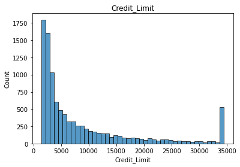

    
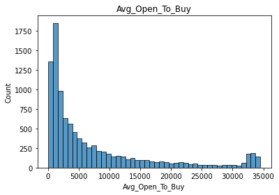
    


    
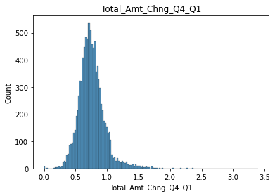
    


    
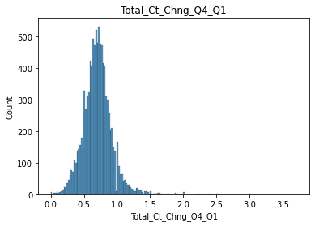
    


    
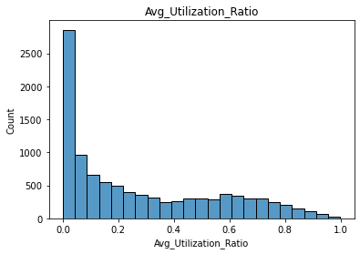
    


Las fetures Credit limit, Avg_Open_To_Buy, Avg_Utilization_Ratio tinen un coeficinte de asimetria muy positivo, por lo tanto una clara desviación de la cola a la derecha, hay más clientes con un límite inferior de crédito, más cliente dispuestos a abrir una liniea de crédito y más clientes que usan la targeta de manera muy frequente en los últimos doce meses.


```python
#Varaibles discretas
discrete_features = dataset.select_dtypes(['int64']).columns.to_list()

for disc_feature in discrete_features: 
    plt.figure()
    plt.title(disc_feature)
    ax = sns.histplot(dataset[disc_feature],kde = False)
```


    
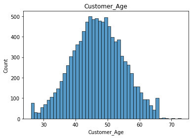
    


    
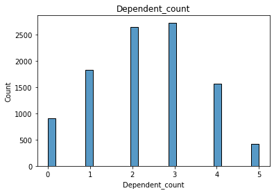
    


    
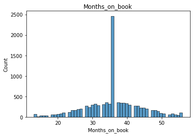
    


    
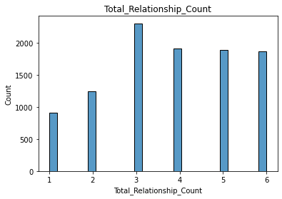
    


    
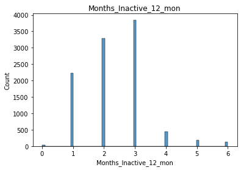
    


    
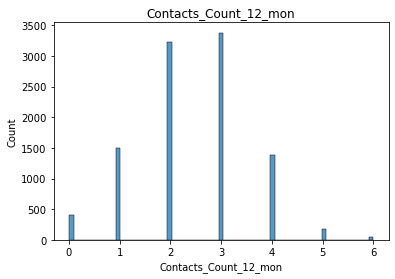
    


    
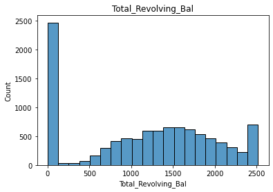
    


    
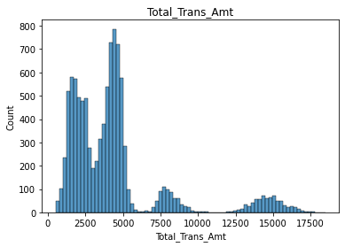
    


    
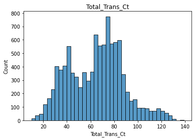
    


En las variables discretas también se observa que hay una gran parte de lso clientes que no usan la targeta y posteriormente se distribuye de forma normal con una media 1.160$. Esa media está en parte desviada por los clientes que no usan la targeta.


```python
#Variables Categoricas

def PlotMultiplePie(df,categorical_features = None,dropna = False):
    # set a threshold of 30 unique variables, more than 50 can lead to ugly pie charts 
    threshold = 30
    
    # if user did not set categorical_features 
    if categorical_features == None: 
        categorical_features = df.select_dtypes(['object','category']).columns.to_list()
        print(categorical_features)
    
    # loop through the list of categorical_features 
    for cat_feature in categorical_features: 
        num_unique = df[cat_feature].nunique(dropna = dropna)
        num_missing = df[cat_feature].isna().sum()
        # prints pie chart and info if unique values below threshold 
        if num_unique <= threshold:
            print('Pie Chart for: ', cat_feature)
            print('Number of Unique Values: ', num_unique)
            print('Number of Missing Values: ', num_missing)
            fig = px.pie(df[cat_feature].value_counts(dropna = dropna), values=cat_feature, 
                 names = df[cat_feature].value_counts(dropna = dropna).index,title = cat_feature,template='ggplot2')
            fig.show()
        else: 
            print('Pie Chart for ',cat_feature,' is unavailable due high number of Unique Values ')
            print('Number of Unique Values: ', num_unique)
            print('Number of Missing Values: ', num_missing)
            print('\n')
    return cat_feature
```


```python
PlotMultiplePie(dataset)
```

    ['Attrition_Flag', 'Gender', 'Education_Level', 'Marital_Status', 'Income_Category', 'Card_Category']
    Pie Chart for:  Attrition_Flag
    Number of Unique Values:  2
    Number of Missing Values:  0
    


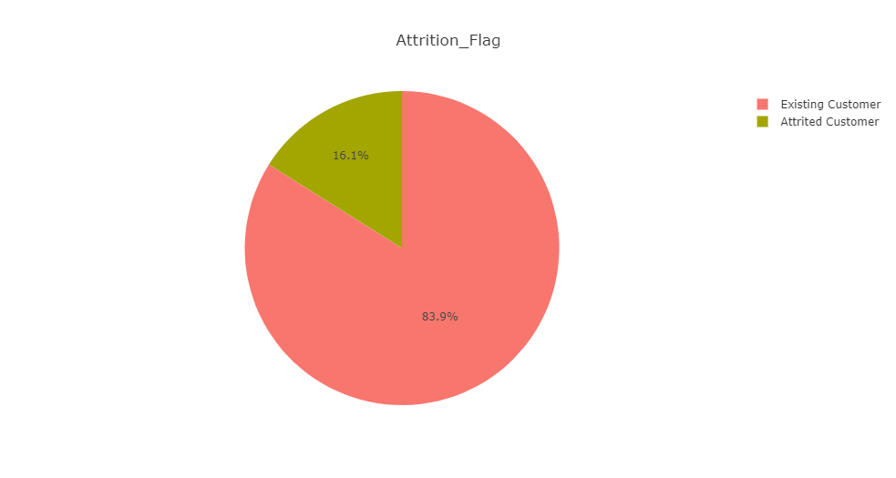


    Pie Chart for:  Gender
    Number of Unique Values:  2
    Number of Missing Values:  0
    

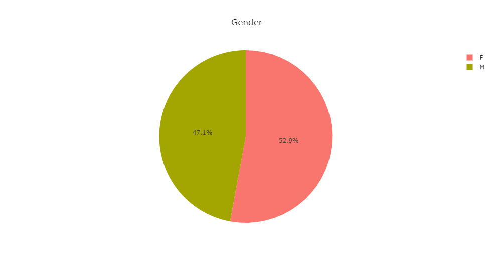                


    Pie Chart for:  Education_Level
    Number of Unique Values:  7
    Number of Missing Values:  0
    

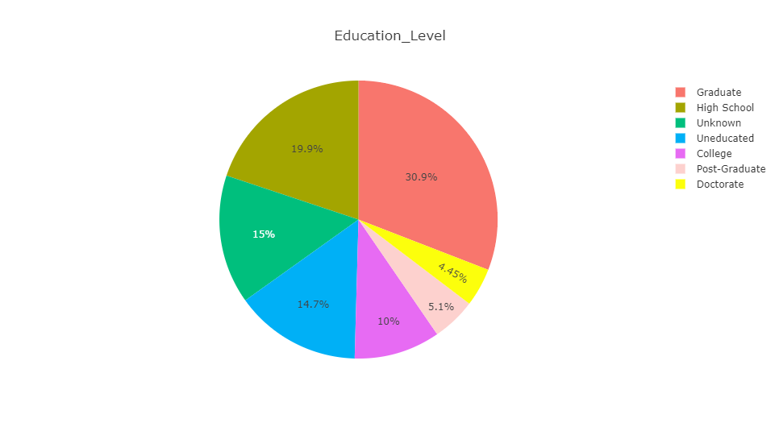  

    Pie Chart for:  Marital_Status
    Number of Unique Values:  4
    Number of Missing Values:  0
    

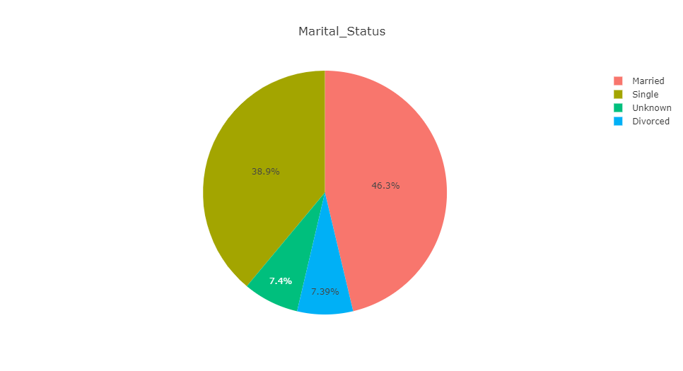                    


    Pie Chart for:  Income_Category
    Number of Unique Values:  6
    Number of Missing Values:  0
    

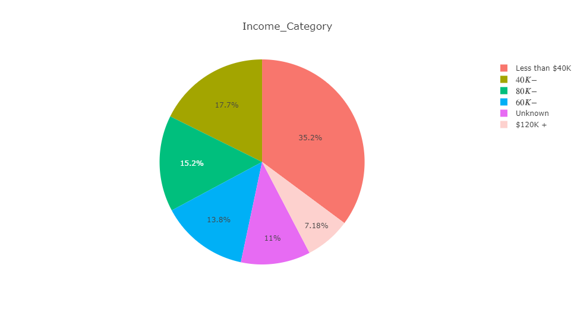  

    Pie Chart for:  Card_Category
    Number of Unique Values:  4
    Number of Missing Values:  0
    

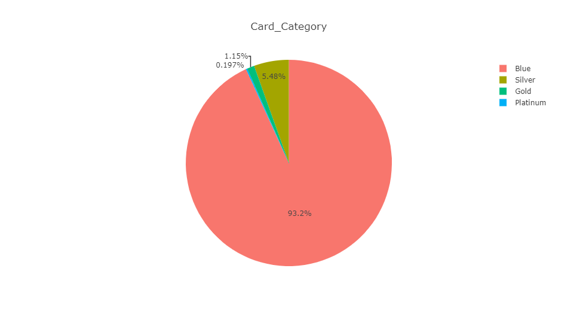  


```python
#Matriz de correlaciones
dataset.corr()
```


<div>
<style scoped>
    .dataframe tbody tr th:only-of-type {
        vertical-align: middle;
    }

    .dataframe tbody tr th {
        vertical-align: top;
    }

    .dataframe thead th {
        text-align: right;
    }
</style>
<table border="1" class="dataframe">
  <thead>
    <tr style="text-align: right;">
      <th></th>
      <th>Customer_Age</th>
      <th>Dependent_count</th>
      <th>Months_on_book</th>
      <th>Total_Relationship_Count</th>
      <th>Months_Inactive_12_mon</th>
      <th>Contacts_Count_12_mon</th>
      <th>Credit_Limit</th>
      <th>Total_Revolving_Bal</th>
      <th>Avg_Open_To_Buy</th>
      <th>Total_Amt_Chng_Q4_Q1</th>
      <th>Total_Trans_Amt</th>
      <th>Total_Trans_Ct</th>
      <th>Total_Ct_Chng_Q4_Q1</th>
      <th>Avg_Utilization_Ratio</th>
    </tr>
  </thead>
  <tbody>
    <tr>
      <th>Customer_Age</th>
      <td>1.000000</td>
      <td>-0.122254</td>
      <td>0.788912</td>
      <td>-0.010931</td>
      <td>0.054361</td>
      <td>-0.018452</td>
      <td>0.002476</td>
      <td>0.014780</td>
      <td>0.001151</td>
      <td>-0.062042</td>
      <td>-0.046446</td>
      <td>-0.067097</td>
      <td>-0.012143</td>
      <td>0.007114</td>
    </tr>
    <tr>
      <th>Dependent_count</th>
      <td>-0.122254</td>
      <td>1.000000</td>
      <td>-0.103062</td>
      <td>-0.039076</td>
      <td>-0.010768</td>
      <td>-0.040505</td>
      <td>0.068065</td>
      <td>-0.002688</td>
      <td>0.068291</td>
      <td>-0.035439</td>
      <td>0.025046</td>
      <td>0.049912</td>
      <td>0.011087</td>
      <td>-0.037135</td>
    </tr>
    <tr>
      <th>Months_on_book</th>
      <td>0.788912</td>
      <td>-0.103062</td>
      <td>1.000000</td>
      <td>-0.009203</td>
      <td>0.074164</td>
      <td>-0.010774</td>
      <td>0.007507</td>
      <td>0.008623</td>
      <td>0.006732</td>
      <td>-0.048959</td>
      <td>-0.038591</td>
      <td>-0.049819</td>
      <td>-0.014072</td>
      <td>-0.007541</td>
    </tr>
    <tr>
      <th>Total_Relationship_Count</th>
      <td>-0.010931</td>
      <td>-0.039076</td>
      <td>-0.009203</td>
      <td>1.000000</td>
      <td>-0.003675</td>
      <td>0.055203</td>
      <td>-0.071386</td>
      <td>0.013726</td>
      <td>-0.072601</td>
      <td>0.050119</td>
      <td>-0.347229</td>
      <td>-0.241891</td>
      <td>0.040831</td>
      <td>0.067663</td>
    </tr>
    <tr>
      <th>Months_Inactive_12_mon</th>
      <td>0.054361</td>
      <td>-0.010768</td>
      <td>0.074164</td>
      <td>-0.003675</td>
      <td>1.000000</td>
      <td>0.029493</td>
      <td>-0.020394</td>
      <td>-0.042210</td>
      <td>-0.016605</td>
      <td>-0.032247</td>
      <td>-0.036982</td>
      <td>-0.042787</td>
      <td>-0.038989</td>
      <td>-0.007503</td>
    </tr>
    <tr>
      <th>Contacts_Count_12_mon</th>
      <td>-0.018452</td>
      <td>-0.040505</td>
      <td>-0.010774</td>
      <td>0.055203</td>
      <td>0.029493</td>
      <td>1.000000</td>
      <td>0.020817</td>
      <td>-0.053913</td>
      <td>0.025646</td>
      <td>-0.024445</td>
      <td>-0.112774</td>
      <td>-0.152213</td>
      <td>-0.094997</td>
      <td>-0.055471</td>
    </tr>
    <tr>
      <th>Credit_Limit</th>
      <td>0.002476</td>
      <td>0.068065</td>
      <td>0.007507</td>
      <td>-0.071386</td>
      <td>-0.020394</td>
      <td>0.020817</td>
      <td>1.000000</td>
      <td>0.042493</td>
      <td>0.995981</td>
      <td>0.012813</td>
      <td>0.171730</td>
      <td>0.075927</td>
      <td>-0.002020</td>
      <td>-0.482965</td>
    </tr>
    <tr>
      <th>Total_Revolving_Bal</th>
      <td>0.014780</td>
      <td>-0.002688</td>
      <td>0.008623</td>
      <td>0.013726</td>
      <td>-0.042210</td>
      <td>-0.053913</td>
      <td>0.042493</td>
      <td>1.000000</td>
      <td>-0.047167</td>
      <td>0.058174</td>
      <td>0.064370</td>
      <td>0.056060</td>
      <td>0.089861</td>
      <td>0.624022</td>
    </tr>
    <tr>
      <th>Avg_Open_To_Buy</th>
      <td>0.001151</td>
      <td>0.068291</td>
      <td>0.006732</td>
      <td>-0.072601</td>
      <td>-0.016605</td>
      <td>0.025646</td>
      <td>0.995981</td>
      <td>-0.047167</td>
      <td>1.000000</td>
      <td>0.007595</td>
      <td>0.165923</td>
      <td>0.070885</td>
      <td>-0.010076</td>
      <td>-0.538808</td>
    </tr>
    <tr>
      <th>Total_Amt_Chng_Q4_Q1</th>
      <td>-0.062042</td>
      <td>-0.035439</td>
      <td>-0.048959</td>
      <td>0.050119</td>
      <td>-0.032247</td>
      <td>-0.024445</td>
      <td>0.012813</td>
      <td>0.058174</td>
      <td>0.007595</td>
      <td>1.000000</td>
      <td>0.039678</td>
      <td>0.005469</td>
      <td>0.384189</td>
      <td>0.035235</td>
    </tr>
    <tr>
      <th>Total_Trans_Amt</th>
      <td>-0.046446</td>
      <td>0.025046</td>
      <td>-0.038591</td>
      <td>-0.347229</td>
      <td>-0.036982</td>
      <td>-0.112774</td>
      <td>0.171730</td>
      <td>0.064370</td>
      <td>0.165923</td>
      <td>0.039678</td>
      <td>1.000000</td>
      <td>0.807192</td>
      <td>0.085581</td>
      <td>-0.083034</td>
    </tr>
    <tr>
      <th>Total_Trans_Ct</th>
      <td>-0.067097</td>
      <td>0.049912</td>
      <td>-0.049819</td>
      <td>-0.241891</td>
      <td>-0.042787</td>
      <td>-0.152213</td>
      <td>0.075927</td>
      <td>0.056060</td>
      <td>0.070885</td>
      <td>0.005469</td>
      <td>0.807192</td>
      <td>1.000000</td>
      <td>0.112324</td>
      <td>0.002838</td>
    </tr>
    <tr>
      <th>Total_Ct_Chng_Q4_Q1</th>
      <td>-0.012143</td>
      <td>0.011087</td>
      <td>-0.014072</td>
      <td>0.040831</td>
      <td>-0.038989</td>
      <td>-0.094997</td>
      <td>-0.002020</td>
      <td>0.089861</td>
      <td>-0.010076</td>
      <td>0.384189</td>
      <td>0.085581</td>
      <td>0.112324</td>
      <td>1.000000</td>
      <td>0.074143</td>
    </tr>
    <tr>
      <th>Avg_Utilization_Ratio</th>
      <td>0.007114</td>
      <td>-0.037135</td>
      <td>-0.007541</td>
      <td>0.067663</td>
      <td>-0.007503</td>
      <td>-0.055471</td>
      <td>-0.482965</td>
      <td>0.624022</td>
      <td>-0.538808</td>
      <td>0.035235</td>
      <td>-0.083034</td>
      <td>0.002838</td>
      <td>0.074143</td>
      <td>1.000000</td>
    </tr>
  </tbody>
</table>
</div>


```python
import seaborn as sn
fig, ax = plt.subplots(figsize=(10,10))
sn.heatmap(dataset.corr(), annot=True, cmap="RdBu_r")
plt.show()
```


    
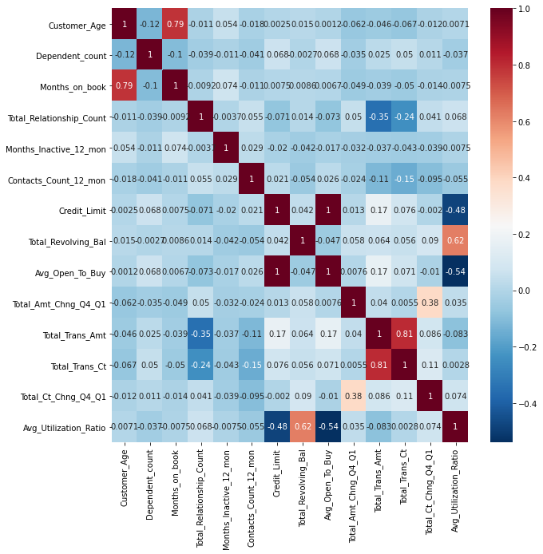
    


Se observa que hay una relación positiva entre las variables edad del cliente y meses que es cliente, lo que dice bien del banco o que el proceso de canviar de bancoo es lento y los clientes no suelen canviar.

Por otro lado hay también una realción positiva entre las veces que han sacado dinero y el total de diner sacado en los últimos 12 meses, lo que indica que que se saca poco dinero cada vez que se saca.

Hay también realción entre el saldo rotatorio en cuenta y la media de uso, indicano que alta rotación influye en más uso de la trageta, clientes con menos dinero usan más la targeta.

Finalmente hay una realción negativa en la media de uso si el limite de credito es bajo o si se está abierto abrir una cuenta nueva.

#### Transformaciones de Features

Target= Attrition_Flag

Existing Customer = 0
Attritied Customer = 1


```python
#Antes creamos una copia del dataset
dataset_copy = dataset.copy()
```


```python
dataset_copy[["Attrition_Flag"]] = dataset_copy[["Attrition_Flag"]].astype('category')
```


```python
for col in dataset_copy.select_dtypes('category').columns.to_list():
    print(col + ': '+ str(dataset_copy[col].cat.categories.to_list()))
```

    Attrition_Flag: ['Attrited Customer', 'Existing Customer']
    


```python
codes = {'Existing Customer':0, 'Attrited Customer':1}
dataset_copy['Attrition_Flag'] = dataset_copy['Attrition_Flag'].map(codes)
```


```python
for col in dataset_copy.select_dtypes('category').columns.to_list():
    print(col + ': '+ str(dataset_copy[col].cat.categories.to_list()))
```

    Attrition_Flag: [1, 0]
    

Separamos en Target (X) y Features (y)


```python
y = dataset_copy["Attrition_Flag"]
X = dataset_copy.drop('Attrition_Flag',errors='ignore',axis=1)
```

Transformaciones de las otras featrues categoricas con OneHot Encoder


```python
X.info()
```

    <class 'pandas.core.frame.DataFrame'>
    RangeIndex: 10127 entries, 0 to 10126
    Data columns (total 19 columns):
     #   Column                    Non-Null Count  Dtype  
    ---  ------                    --------------  -----  
     0   Customer_Age              10127 non-null  int64  
     1   Gender                    10127 non-null  object 
     2   Dependent_count           10127 non-null  int64  
     3   Education_Level           10127 non-null  object 
     4   Marital_Status            10127 non-null  object 
     5   Income_Category           10127 non-null  object 
     6   Card_Category             10127 non-null  object 
     7   Months_on_book            10127 non-null  int64  
     8   Total_Relationship_Count  10127 non-null  int64  
     9   Months_Inactive_12_mon    10127 non-null  int64  
     10  Contacts_Count_12_mon     10127 non-null  int64  
     11  Credit_Limit              10127 non-null  float64
     12  Total_Revolving_Bal       10127 non-null  int64  
     13  Avg_Open_To_Buy           10127 non-null  float64
     14  Total_Amt_Chng_Q4_Q1      10127 non-null  float64
     15  Total_Trans_Amt           10127 non-null  int64  
     16  Total_Trans_Ct            10127 non-null  int64  
     17  Total_Ct_Chng_Q4_Q1       10127 non-null  float64
     18  Avg_Utilization_Ratio     10127 non-null  float64
    dtypes: float64(5), int64(9), object(5)
    memory usage: 1.5+ MB
    


```python
X.head()
```


<div>
<style scoped>
    .dataframe tbody tr th:only-of-type {
        vertical-align: middle;
    }

    .dataframe tbody tr th {
        vertical-align: top;
    }

    .dataframe thead th {
        text-align: right;
    }
</style>
<table border="1" class="dataframe">
  <thead>
    <tr style="text-align: right;">
      <th></th>
      <th>Customer_Age</th>
      <th>Gender</th>
      <th>Dependent_count</th>
      <th>Education_Level</th>
      <th>Marital_Status</th>
      <th>Income_Category</th>
      <th>Card_Category</th>
      <th>Months_on_book</th>
      <th>Total_Relationship_Count</th>
      <th>Months_Inactive_12_mon</th>
      <th>Contacts_Count_12_mon</th>
      <th>Credit_Limit</th>
      <th>Total_Revolving_Bal</th>
      <th>Avg_Open_To_Buy</th>
      <th>Total_Amt_Chng_Q4_Q1</th>
      <th>Total_Trans_Amt</th>
      <th>Total_Trans_Ct</th>
      <th>Total_Ct_Chng_Q4_Q1</th>
      <th>Avg_Utilization_Ratio</th>
    </tr>
  </thead>
  <tbody>
    <tr>
      <th>0</th>
      <td>45</td>
      <td>M</td>
      <td>3</td>
      <td>High School</td>
      <td>Married</td>
      <td>$60K - $80K</td>
      <td>Blue</td>
      <td>39</td>
      <td>5</td>
      <td>1</td>
      <td>3</td>
      <td>12691.0</td>
      <td>777</td>
      <td>11914.0</td>
      <td>1.335</td>
      <td>1144</td>
      <td>42</td>
      <td>1.625</td>
      <td>0.061</td>
    </tr>
    <tr>
      <th>1</th>
      <td>49</td>
      <td>F</td>
      <td>5</td>
      <td>Graduate</td>
      <td>Single</td>
      <td>Less than $40K</td>
      <td>Blue</td>
      <td>44</td>
      <td>6</td>
      <td>1</td>
      <td>2</td>
      <td>8256.0</td>
      <td>864</td>
      <td>7392.0</td>
      <td>1.541</td>
      <td>1291</td>
      <td>33</td>
      <td>3.714</td>
      <td>0.105</td>
    </tr>
    <tr>
      <th>2</th>
      <td>51</td>
      <td>M</td>
      <td>3</td>
      <td>Graduate</td>
      <td>Married</td>
      <td>$80K - $120K</td>
      <td>Blue</td>
      <td>36</td>
      <td>4</td>
      <td>1</td>
      <td>0</td>
      <td>3418.0</td>
      <td>0</td>
      <td>3418.0</td>
      <td>2.594</td>
      <td>1887</td>
      <td>20</td>
      <td>2.333</td>
      <td>0.000</td>
    </tr>
    <tr>
      <th>3</th>
      <td>40</td>
      <td>F</td>
      <td>4</td>
      <td>High School</td>
      <td>Unknown</td>
      <td>Less than $40K</td>
      <td>Blue</td>
      <td>34</td>
      <td>3</td>
      <td>4</td>
      <td>1</td>
      <td>3313.0</td>
      <td>2517</td>
      <td>796.0</td>
      <td>1.405</td>
      <td>1171</td>
      <td>20</td>
      <td>2.333</td>
      <td>0.760</td>
    </tr>
    <tr>
      <th>4</th>
      <td>40</td>
      <td>M</td>
      <td>3</td>
      <td>Uneducated</td>
      <td>Married</td>
      <td>$60K - $80K</td>
      <td>Blue</td>
      <td>21</td>
      <td>5</td>
      <td>1</td>
      <td>0</td>
      <td>4716.0</td>
      <td>0</td>
      <td>4716.0</td>
      <td>2.175</td>
      <td>816</td>
      <td>28</td>
      <td>2.500</td>
      <td>0.000</td>
    </tr>
  </tbody>
</table>
</div>


```python
X[['Gender',"Education_Level", "Marital_Status", "Income_Category", "Card_Category"]] = X[['Gender',"Education_Level", "Marital_Status", "Income_Category", "Card_Category"]].astype('category')
```


```python
X.info()
```

    <class 'pandas.core.frame.DataFrame'>
    RangeIndex: 10127 entries, 0 to 10126
    Data columns (total 19 columns):
     #   Column                    Non-Null Count  Dtype   
    ---  ------                    --------------  -----   
     0   Customer_Age              10127 non-null  int64   
     1   Gender                    10127 non-null  category
     2   Dependent_count           10127 non-null  int64   
     3   Education_Level           10127 non-null  category
     4   Marital_Status            10127 non-null  category
     5   Income_Category           10127 non-null  category
     6   Card_Category             10127 non-null  category
     7   Months_on_book            10127 non-null  int64   
     8   Total_Relationship_Count  10127 non-null  int64   
     9   Months_Inactive_12_mon    10127 non-null  int64   
     10  Contacts_Count_12_mon     10127 non-null  int64   
     11  Credit_Limit              10127 non-null  float64 
     12  Total_Revolving_Bal       10127 non-null  int64   
     13  Avg_Open_To_Buy           10127 non-null  float64 
     14  Total_Amt_Chng_Q4_Q1      10127 non-null  float64 
     15  Total_Trans_Amt           10127 non-null  int64   
     16  Total_Trans_Ct            10127 non-null  int64   
     17  Total_Ct_Chng_Q4_Q1       10127 non-null  float64 
     18  Avg_Utilization_Ratio     10127 non-null  float64 
    dtypes: category(5), float64(5), int64(9)
    memory usage: 1.1 MB
    


```python
for col in X.select_dtypes('category').columns.to_list():
    print(col + ': '+ str(X[col].cat.categories.to_list()))
```

    Gender: ['F', 'M']
    Education_Level: ['College', 'Doctorate', 'Graduate', 'High School', 'Post-Graduate', 'Uneducated', 'Unknown']
    Marital_Status: ['Divorced', 'Married', 'Single', 'Unknown']
    Income_Category: ['$120K +', '$40K - $60K', '$60K - $80K', '$80K - $120K', 'Less than $40K', 'Unknown']
    Card_Category: ['Blue', 'Gold', 'Platinum', 'Silver']
    


```python
#Usaremos Dummies para las varaibles categoricas
def encode_and_bind(original_dataframe, feature_to_encode):
    dummies = pd.get_dummies(original_dataframe[[feature_to_encode]])
    res = pd.concat([original_dataframe, dummies], axis=1)
    res = res.drop([feature_to_encode], axis=1)
    return(res) 

features_to_encode = X.select_dtypes('category').columns.to_list()
for feature in features_to_encode:
    X = encode_and_bind(X, feature)
```


```python
X.info()
```

    <class 'pandas.core.frame.DataFrame'>
    RangeIndex: 10127 entries, 0 to 10126
    Data columns (total 37 columns):
     #   Column                          Non-Null Count  Dtype  
    ---  ------                          --------------  -----  
     0   Customer_Age                    10127 non-null  int64  
     1   Dependent_count                 10127 non-null  int64  
     2   Months_on_book                  10127 non-null  int64  
     3   Total_Relationship_Count        10127 non-null  int64  
     4   Months_Inactive_12_mon          10127 non-null  int64  
     5   Contacts_Count_12_mon           10127 non-null  int64  
     6   Credit_Limit                    10127 non-null  float64
     7   Total_Revolving_Bal             10127 non-null  int64  
     8   Avg_Open_To_Buy                 10127 non-null  float64
     9   Total_Amt_Chng_Q4_Q1            10127 non-null  float64
     10  Total_Trans_Amt                 10127 non-null  int64  
     11  Total_Trans_Ct                  10127 non-null  int64  
     12  Total_Ct_Chng_Q4_Q1             10127 non-null  float64
     13  Avg_Utilization_Ratio           10127 non-null  float64
     14  Gender_F                        10127 non-null  uint8  
     15  Gender_M                        10127 non-null  uint8  
     16  Education_Level_College         10127 non-null  uint8  
     17  Education_Level_Doctorate       10127 non-null  uint8  
     18  Education_Level_Graduate        10127 non-null  uint8  
     19  Education_Level_High School     10127 non-null  uint8  
     20  Education_Level_Post-Graduate   10127 non-null  uint8  
     21  Education_Level_Uneducated      10127 non-null  uint8  
     22  Education_Level_Unknown         10127 non-null  uint8  
     23  Marital_Status_Divorced         10127 non-null  uint8  
     24  Marital_Status_Married          10127 non-null  uint8  
     25  Marital_Status_Single           10127 non-null  uint8  
     26  Marital_Status_Unknown          10127 non-null  uint8  
     27  Income_Category_$120K +         10127 non-null  uint8  
     28  Income_Category_$40K - $60K     10127 non-null  uint8  
     29  Income_Category_$60K - $80K     10127 non-null  uint8  
     30  Income_Category_$80K - $120K    10127 non-null  uint8  
     31  Income_Category_Less than $40K  10127 non-null  uint8  
     32  Income_Category_Unknown         10127 non-null  uint8  
     33  Card_Category_Blue              10127 non-null  uint8  
     34  Card_Category_Gold              10127 non-null  uint8  
     35  Card_Category_Platinum          10127 non-null  uint8  
     36  Card_Category_Silver            10127 non-null  uint8  
    dtypes: float64(5), int64(9), uint8(23)
    memory usage: 1.3 MB
    


```python
X.head()
```


<div>
<style scoped>
    .dataframe tbody tr th:only-of-type {
        vertical-align: middle;
    }

    .dataframe tbody tr th {
        vertical-align: top;
    }

    .dataframe thead th {
        text-align: right;
    }
</style>
<table border="1" class="dataframe">
  <thead>
    <tr style="text-align: right;">
      <th></th>
      <th>Customer_Age</th>
      <th>Dependent_count</th>
      <th>Months_on_book</th>
      <th>Total_Relationship_Count</th>
      <th>Months_Inactive_12_mon</th>
      <th>Contacts_Count_12_mon</th>
      <th>Credit_Limit</th>
      <th>Total_Revolving_Bal</th>
      <th>Avg_Open_To_Buy</th>
      <th>Total_Amt_Chng_Q4_Q1</th>
      <th>...</th>
      <th>Income_Category_$120K +</th>
      <th>Income_Category_$40K - $60K</th>
      <th>Income_Category_$60K - $80K</th>
      <th>Income_Category_$80K - $120K</th>
      <th>Income_Category_Less than $40K</th>
      <th>Income_Category_Unknown</th>
      <th>Card_Category_Blue</th>
      <th>Card_Category_Gold</th>
      <th>Card_Category_Platinum</th>
      <th>Card_Category_Silver</th>
    </tr>
  </thead>
  <tbody>
    <tr>
      <th>0</th>
      <td>45</td>
      <td>3</td>
      <td>39</td>
      <td>5</td>
      <td>1</td>
      <td>3</td>
      <td>12691.0</td>
      <td>777</td>
      <td>11914.0</td>
      <td>1.335</td>
      <td>...</td>
      <td>0</td>
      <td>0</td>
      <td>1</td>
      <td>0</td>
      <td>0</td>
      <td>0</td>
      <td>1</td>
      <td>0</td>
      <td>0</td>
      <td>0</td>
    </tr>
    <tr>
      <th>1</th>
      <td>49</td>
      <td>5</td>
      <td>44</td>
      <td>6</td>
      <td>1</td>
      <td>2</td>
      <td>8256.0</td>
      <td>864</td>
      <td>7392.0</td>
      <td>1.541</td>
      <td>...</td>
      <td>0</td>
      <td>0</td>
      <td>0</td>
      <td>0</td>
      <td>1</td>
      <td>0</td>
      <td>1</td>
      <td>0</td>
      <td>0</td>
      <td>0</td>
    </tr>
    <tr>
      <th>2</th>
      <td>51</td>
      <td>3</td>
      <td>36</td>
      <td>4</td>
      <td>1</td>
      <td>0</td>
      <td>3418.0</td>
      <td>0</td>
      <td>3418.0</td>
      <td>2.594</td>
      <td>...</td>
      <td>0</td>
      <td>0</td>
      <td>0</td>
      <td>1</td>
      <td>0</td>
      <td>0</td>
      <td>1</td>
      <td>0</td>
      <td>0</td>
      <td>0</td>
    </tr>
    <tr>
      <th>3</th>
      <td>40</td>
      <td>4</td>
      <td>34</td>
      <td>3</td>
      <td>4</td>
      <td>1</td>
      <td>3313.0</td>
      <td>2517</td>
      <td>796.0</td>
      <td>1.405</td>
      <td>...</td>
      <td>0</td>
      <td>0</td>
      <td>0</td>
      <td>0</td>
      <td>1</td>
      <td>0</td>
      <td>1</td>
      <td>0</td>
      <td>0</td>
      <td>0</td>
    </tr>
    <tr>
      <th>4</th>
      <td>40</td>
      <td>3</td>
      <td>21</td>
      <td>5</td>
      <td>1</td>
      <td>0</td>
      <td>4716.0</td>
      <td>0</td>
      <td>4716.0</td>
      <td>2.175</td>
      <td>...</td>
      <td>0</td>
      <td>0</td>
      <td>1</td>
      <td>0</td>
      <td>0</td>
      <td>0</td>
      <td>1</td>
      <td>0</td>
      <td>0</td>
      <td>0</td>
    </tr>
  </tbody>
</table>
<p>5 rows × 37 columns</p>
</div>


#### Separación en train y test


```python
#La varaible target será el Atrrition flag y tal como hemos visto, solo hay un 16% de Atrriet customer, por lo que debemos 
#estratificar la partición en train y test para que obtener datos con la misma representación en train y test
from sklearn.model_selection import train_test_split
X_train, X_test, y_train, y_test  = train_test_split(X, y, test_size=0.2, random_state=0, stratify=y)
```


```python
X_train.info()
```

    <class 'pandas.core.frame.DataFrame'>
    Int64Index: 8101 entries, 9893 to 4344
    Data columns (total 37 columns):
     #   Column                          Non-Null Count  Dtype  
    ---  ------                          --------------  -----  
     0   Customer_Age                    8101 non-null   int64  
     1   Dependent_count                 8101 non-null   int64  
     2   Months_on_book                  8101 non-null   int64  
     3   Total_Relationship_Count        8101 non-null   int64  
     4   Months_Inactive_12_mon          8101 non-null   int64  
     5   Contacts_Count_12_mon           8101 non-null   int64  
     6   Credit_Limit                    8101 non-null   float64
     7   Total_Revolving_Bal             8101 non-null   int64  
     8   Avg_Open_To_Buy                 8101 non-null   float64
     9   Total_Amt_Chng_Q4_Q1            8101 non-null   float64
     10  Total_Trans_Amt                 8101 non-null   int64  
     11  Total_Trans_Ct                  8101 non-null   int64  
     12  Total_Ct_Chng_Q4_Q1             8101 non-null   float64
     13  Avg_Utilization_Ratio           8101 non-null   float64
     14  Gender_F                        8101 non-null   uint8  
     15  Gender_M                        8101 non-null   uint8  
     16  Education_Level_College         8101 non-null   uint8  
     17  Education_Level_Doctorate       8101 non-null   uint8  
     18  Education_Level_Graduate        8101 non-null   uint8  
     19  Education_Level_High School     8101 non-null   uint8  
     20  Education_Level_Post-Graduate   8101 non-null   uint8  
     21  Education_Level_Uneducated      8101 non-null   uint8  
     22  Education_Level_Unknown         8101 non-null   uint8  
     23  Marital_Status_Divorced         8101 non-null   uint8  
     24  Marital_Status_Married          8101 non-null   uint8  
     25  Marital_Status_Single           8101 non-null   uint8  
     26  Marital_Status_Unknown          8101 non-null   uint8  
     27  Income_Category_$120K +         8101 non-null   uint8  
     28  Income_Category_$40K - $60K     8101 non-null   uint8  
     29  Income_Category_$60K - $80K     8101 non-null   uint8  
     30  Income_Category_$80K - $120K    8101 non-null   uint8  
     31  Income_Category_Less than $40K  8101 non-null   uint8  
     32  Income_Category_Unknown         8101 non-null   uint8  
     33  Card_Category_Blue              8101 non-null   uint8  
     34  Card_Category_Gold              8101 non-null   uint8  
     35  Card_Category_Platinum          8101 non-null   uint8  
     36  Card_Category_Silver            8101 non-null   uint8  
    dtypes: float64(5), int64(9), uint8(23)
    memory usage: 1.1 MB
    

#### Outliers


```python
from scipy import stats
header = list(X_train)

# Obtenemos los z-score para cada feature
for feat in header:
    try:
        z = stats.zscore(X_train[feat])
        print("feature: " + feat + ". Max z-score: " + str(z.max()) + ". Min z-score: " + str(z.min()))
    except TypeError:
        print("Can't calculate z-score for feature " + feat + ". It's "+ str(type(X_train[feat].values[0])))
        pass
```

    feature: Customer_Age. Max z-score: 3.311213058514454. Min z-score: -2.537732834949226
    feature: Dependent_count. Max z-score: 2.0419402258157304. Min z-score: -1.8040857610090153
    feature: Months_on_book. Max z-score: 2.516386084866579. Min z-score: -2.8873403150389705
    feature: Total_Relationship_Count. Max z-score: 1.4182535589949616. Min z-score: -1.8049053035473106
    feature: Months_Inactive_12_mon. Max z-score: 3.602110544319535. Min z-score: -2.309700136298891
    feature: Contacts_Count_12_mon. Max z-score: 3.199276212938734. Min z-score: -2.210688287690966
    feature: Credit_Limit. Max z-score: 2.8389374922548787. Min z-score: -0.7949716635802524
    feature: Total_Revolving_Bal. Max z-score: 1.674337289737906. Min z-score: -1.411889003291074
    feature: Avg_Open_To_Buy. Max z-score: 2.9673311689946944. Min z-score: -0.8266794060385567
    feature: Total_Amt_Chng_Q4_Q1. Max z-score: 11.976825898974745. Min z-score: -3.4494605428765763
    feature: Total_Trans_Amt. Max z-score: 4.127772849788472. Min z-score: -1.1371025578195864
    feature: Total_Trans_Ct. Max z-score: 3.151848389253345. Min z-score: -2.327709107432798
    feature: Total_Ct_Chng_Q4_Q1. Max z-score: 12.586814637843185. Min z-score: -2.9709057564525163
    feature: Avg_Utilization_Ratio. Max z-score: 2.6647538822845167. Min z-score: -0.987924980513382
    feature: Gender_F. Max z-score: 0.9434549942515832. Min z-score: -1.0599339725720278
    feature: Gender_M. Max z-score: 1.0599339725720278. Min z-score: -0.9434549942515832
    feature: Education_Level_College. Max z-score: 3.004328560429085. Min z-score: -0.33285307511678336
    feature: Education_Level_Doctorate. Max z-score: 4.671158133681534. Min z-score: -0.21407967176051443
    feature: Education_Level_Graduate. Max z-score: 1.508568330170486. Min z-score: -0.662880149344636
    feature: Education_Level_High School. Max z-score: 2.000926283337966. Min z-score: -0.49976853636596225
    feature: Education_Level_Post-Graduate. Max z-score: 4.331112626723744. Min z-score: -0.23088755388853666
    feature: Education_Level_Uneducated. Max z-score: 2.395746369204679. Min z-score: -0.4174064553970176
    feature: Education_Level_Unknown. Max z-score: 2.358989152522323. Min z-score: -0.4239103850608048
    feature: Marital_Status_Divorced. Max z-score: 3.5012272807343474. Min z-score: -0.2856141346500249
    feature: Marital_Status_Married. Max z-score: 1.0731542417380762. Min z-score: -0.9318325000331772
    feature: Marital_Status_Single. Max z-score: 1.2566283983542874. Min z-score: -0.7957802014578259
    feature: Marital_Status_Unknown. Max z-score: 3.5876977774703587. Min z-score: -0.2787302783081933
    feature: Income_Category_$120K +. Max z-score: 3.601005606675772. Min z-score: -0.27770020633851183
    feature: Income_Category_$40K - $60K. Max z-score: 2.214614853747106. Min z-score: -0.45154578382241495
    feature: Income_Category_$60K - $80K. Max z-score: 2.447375379210237. Min z-score: -0.4086009888367423
    feature: Income_Category_$80K - $120K. Max z-score: 2.368051352999013. Min z-score: -0.4222881394584422
    feature: Income_Category_Less than $40K. Max z-score: 1.352973793262481. Min z-score: -0.7391126162086696
    feature: Income_Category_Unknown. Max z-score: 2.8250934486045085. Min z-score: -0.3539705918379312
    feature: Card_Category_Blue. Max z-score: 0.26988522504463075. Min z-score: -3.705278789658197
    feature: Card_Category_Gold. Max z-score: 9.036772947580484. Min z-score: -0.11065897149355085
    feature: Card_Category_Platinum. Max z-score: 21.806636874234087. Min z-score: -0.045857598572733735
    feature: Card_Category_Silver. Max z-score: 4.197974333621768. Min z-score: -0.23821012720133955
    


```python
#Hay dos features con valores algo desviados, son el Total_Amt_Chng_Q4_Q1 y Total_Ct_Chng_Q4_Q1

# Vamos a investigar la distribución de la feature population que se va 
# más allá de 12...
z1 = stats.zscore(X_train['Total_Amt_Chng_Q4_Q1'])
z2 = stats.zscore(X_train['Total_Ct_Chng_Q4_Q1'])
```


```python
# Examinemos por ejemplo aquellos z-score mayores que 10 (nos da los indices)
print(np.where(z1 > 10))
print(np.where(z2 > 10))
```

    (array([6074, 7185], dtype=int64),)
    (array([2363, 2937, 6074], dtype=int64),)
    


```python
# ¿A qué registros corresponden esos z-score?
X_train.iloc[np.where(z1 > 10)]
```


<div>
<style scoped>
    .dataframe tbody tr th:only-of-type {
        vertical-align: middle;
    }

    .dataframe tbody tr th {
        vertical-align: top;
    }

    .dataframe thead th {
        text-align: right;
    }
</style>
<table border="1" class="dataframe">
  <thead>
    <tr style="text-align: right;">
      <th></th>
      <th>Customer_Age</th>
      <th>Dependent_count</th>
      <th>Months_on_book</th>
      <th>Total_Relationship_Count</th>
      <th>Months_Inactive_12_mon</th>
      <th>Contacts_Count_12_mon</th>
      <th>Credit_Limit</th>
      <th>Total_Revolving_Bal</th>
      <th>Avg_Open_To_Buy</th>
      <th>Total_Amt_Chng_Q4_Q1</th>
      <th>...</th>
      <th>Income_Category_$120K +</th>
      <th>Income_Category_$40K - $60K</th>
      <th>Income_Category_$60K - $80K</th>
      <th>Income_Category_$80K - $120K</th>
      <th>Income_Category_Less than $40K</th>
      <th>Income_Category_Unknown</th>
      <th>Card_Category_Blue</th>
      <th>Card_Category_Gold</th>
      <th>Card_Category_Platinum</th>
      <th>Card_Category_Silver</th>
    </tr>
  </thead>
  <tbody>
    <tr>
      <th>12</th>
      <td>56</td>
      <td>1</td>
      <td>36</td>
      <td>3</td>
      <td>6</td>
      <td>0</td>
      <td>11751.0</td>
      <td>0</td>
      <td>11751.0</td>
      <td>3.397</td>
      <td>...</td>
      <td>0</td>
      <td>0</td>
      <td>0</td>
      <td>1</td>
      <td>0</td>
      <td>0</td>
      <td>1</td>
      <td>0</td>
      <td>0</td>
      <td>0</td>
    </tr>
    <tr>
      <th>8</th>
      <td>37</td>
      <td>3</td>
      <td>36</td>
      <td>5</td>
      <td>2</td>
      <td>0</td>
      <td>22352.0</td>
      <td>2517</td>
      <td>19835.0</td>
      <td>3.355</td>
      <td>...</td>
      <td>0</td>
      <td>0</td>
      <td>1</td>
      <td>0</td>
      <td>0</td>
      <td>0</td>
      <td>1</td>
      <td>0</td>
      <td>0</td>
      <td>0</td>
    </tr>
  </tbody>
</table>
<p>2 rows × 37 columns</p>
</div>


```python
# ¿A qué registros corresponden esos z-score?
X_train.iloc[np.where(z2 > 10)]
```


<div>
<style scoped>
    .dataframe tbody tr th:only-of-type {
        vertical-align: middle;
    }

    .dataframe tbody tr th {
        vertical-align: top;
    }

    .dataframe thead th {
        text-align: right;
    }
</style>
<table border="1" class="dataframe">
  <thead>
    <tr style="text-align: right;">
      <th></th>
      <th>Customer_Age</th>
      <th>Dependent_count</th>
      <th>Months_on_book</th>
      <th>Total_Relationship_Count</th>
      <th>Months_Inactive_12_mon</th>
      <th>Contacts_Count_12_mon</th>
      <th>Credit_Limit</th>
      <th>Total_Revolving_Bal</th>
      <th>Avg_Open_To_Buy</th>
      <th>Total_Amt_Chng_Q4_Q1</th>
      <th>...</th>
      <th>Income_Category_$120K +</th>
      <th>Income_Category_$40K - $60K</th>
      <th>Income_Category_$60K - $80K</th>
      <th>Income_Category_$80K - $120K</th>
      <th>Income_Category_Less than $40K</th>
      <th>Income_Category_Unknown</th>
      <th>Card_Category_Blue</th>
      <th>Card_Category_Gold</th>
      <th>Card_Category_Platinum</th>
      <th>Card_Category_Silver</th>
    </tr>
  </thead>
  <tbody>
    <tr>
      <th>269</th>
      <td>54</td>
      <td>5</td>
      <td>38</td>
      <td>3</td>
      <td>3</td>
      <td>3</td>
      <td>2290.0</td>
      <td>1434</td>
      <td>856.0</td>
      <td>0.923</td>
      <td>...</td>
      <td>0</td>
      <td>0</td>
      <td>1</td>
      <td>0</td>
      <td>0</td>
      <td>0</td>
      <td>1</td>
      <td>0</td>
      <td>0</td>
      <td>0</td>
    </tr>
    <tr>
      <th>1</th>
      <td>49</td>
      <td>5</td>
      <td>44</td>
      <td>6</td>
      <td>1</td>
      <td>2</td>
      <td>8256.0</td>
      <td>864</td>
      <td>7392.0</td>
      <td>1.541</td>
      <td>...</td>
      <td>0</td>
      <td>0</td>
      <td>0</td>
      <td>0</td>
      <td>1</td>
      <td>0</td>
      <td>1</td>
      <td>0</td>
      <td>0</td>
      <td>0</td>
    </tr>
    <tr>
      <th>12</th>
      <td>56</td>
      <td>1</td>
      <td>36</td>
      <td>3</td>
      <td>6</td>
      <td>0</td>
      <td>11751.0</td>
      <td>0</td>
      <td>11751.0</td>
      <td>3.397</td>
      <td>...</td>
      <td>0</td>
      <td>0</td>
      <td>0</td>
      <td>1</td>
      <td>0</td>
      <td>0</td>
      <td>1</td>
      <td>0</td>
      <td>0</td>
      <td>0</td>
    </tr>
  </tbody>
</table>
<p>3 rows × 37 columns</p>
</div>


Los Outliers se encuentran en variables que identifican diferencias entre transacciones entre trimestres:

Total_Amt_Chng_Q4_Q1: Change in Transaction Amount (Q4 over Q1)
Total_Ct_Chng_Q4_Q1: Change in Transaction Count (Q4 over Q1)

Por lo que se podria investigar al cliente si ha debido hacer más gasto en un trimetre u otro, o podria servir para detectar alguna anomalia de fraude. De momento decidimos no eliminar no armonizar estos Outliers.

### Clasificación

#### Creación del Pipeline


```python
from sklearn.pipeline import Pipeline
```


```python
#Primero pondremos los modelos que no requieren de escalado de variables

# Arbol de decisión
from sklearn.tree import DecisionTreeClassifier
arbol=DecisionTreeClassifier()


# Naïve Bayes:
from sklearn.naive_bayes import GaussianNB
nb = GaussianNB()


#Random Forest
from sklearn.ensemble import RandomForestClassifier
rf=RandomForestClassifier()


# Extra tree classifier
from sklearn.ensemble import ExtraTreesClassifier
et=ExtraTreesClassifier()


#Gradien boosting
from sklearn.ensemble import GradientBoostingClassifier
GB=GradientBoostingClassifier()


#En los siguientes modelos si vamos a escalar las featrues, por lo tanto lo pondremos dentro un Pipeline
from sklearn.preprocessing import StandardScaler


#Regresión logística
from sklearn.linear_model import LogisticRegression

logr_sc = Pipeline(steps=[("scaler",StandardScaler()),
                         ("logr",LogisticRegression())
                         ]
                  )   


#KNeighborsClassifier
from sklearn.neighbors import KNeighborsClassifier

knn_sc = Pipeline(steps=[("scaler",StandardScaler()),
                         ("knn",KNeighborsClassifier())
                         ]
                  ) 


#Support Vector Machine
from sklearn.svm import SVC

svc_sc = Pipeline(steps=[("scaler",StandardScaler()),
                         ("svc",SVC())
                         ]
                  )


#Red Neuronal
from sklearn.neural_network import MLPClassifier

red_sc = Pipeline(steps=[("scaler",StandardScaler()),
                         ("red",MLPClassifier())
                         ]
                  )
```

#### Grids de Hiperparámetros


```python
#Definición de los hiperparámetros de cada uno de los Pipelines anteriormente definidos

#Arbol de decisión
grid_arbol = {"max_depth":list(range(1,6)),   #Profundidad del 1 al 5
             "random_state":[0]}

#Naïve Bayes
#ninguno


#Random Forest
grid_random_forest = {"n_estimators":[50],
                     "max_depth": [3, 5, 10],
                     "max_features": ["sqrt", 3, 4],
                      "random_state":[0]
                     }

#Extra Tree 
grid_extra_tree = {"n_estimators":[50],
                   "max_depth": [3, 5, 10],
                   "random_state":[0]
                  }

#Gradient Boosting
grid_gradient_boosting = {"loss": ["deviance"],
                          "learning_rate": [0.05, 0.1, 0.2, 0.5],
                          "n_estimators": [20, 50, 100, 500],
                          "subsample": [1.0, 0.5],
                          "max_features": ["sqrt", "auto"],
                          "min_samples_split" : [2, 5, 10],
                          "random_state":[0]
                          }


#Regresión Logística
grid_logr = {"logr__penalty":["none"],
            #"logr__C": [0.1, 0.5, 1.0, 5.0],
            "logr__max_iter": [50,100,500]
            }

#Nearest Neighbors
grid_knn = {"knn__n_neighbors": [2,3,5,10],
           "knn__weights": ["uniform","distance"]
           }
            

#Support Vector Machine
grid_svc = {"svc__C": [0.01, 0.1, 0.5, 1.0, 5.0, 10.0], 
            "svc__gamma": [0.001, 0.1, 1.0, "auto",10.0, 30.0],  
            "svc__probability":[1],
            "svc__random_state":[0]
           }   

                          
#Red Neuronal
grid_red = {"red__hidden_layer_sizes":[(3,3),
                                       (3,),
                                       (20,20)],
           "red__activation":["logistic","relu","tanh"],
           "red__solver":["adam"],
           "red__batch_size":["auto"],
           "red__early_stopping": [True],
           "red__max_iter":[1000],
           "red__learning_rate_init": [0.001, 0.1, 0.5],
           "red__random_state":[0]
           }

```

#### Grid Search


```python
from sklearn.model_selection import GridSearchCV

gs_arbol = GridSearchCV(arbol,
                       grid_arbol,
                       cv=10,
                       scoring="accuracy",
                       verbose=1,
                       n_jobs=-1)


gs_naive_bayes = GridSearchCV(nb,
                              {},
                              cv=10,
                              scoring="accuracy",
                              verbose=1,
                              n_jobs=-1)


gs_random_forest = GridSearchCV(rf,
                       grid_random_forest,
                       cv=10,
                       scoring="accuracy",
                       verbose=1,
                       n_jobs=-1)

gs_extra_tree = GridSearchCV(et,
                       grid_extra_tree,
                       cv=10,
                       scoring="accuracy",
                       verbose=1,
                       n_jobs=-1)


gs_gradient_boosting = GridSearchCV(GB,
                       grid_gradient_boosting,
                       cv=5,
                       scoring="accuracy",
                       verbose=1,
                       n_jobs=-1)


gs_logistic_r = GridSearchCV(logr_sc,
                       grid_logr,
                       cv=10,
                       scoring="accuracy",
                       verbose=1,
                       n_jobs=-1)


gs_knn = GridSearchCV(knn_sc,
                       grid_knn,
                       cv=10,
                       scoring="accuracy",
                       verbose=1,
                       n_jobs=-1)


gs_svc = GridSearchCV(svc_sc,
                       grid_svc,
                       cv=5,
                       scoring="accuracy",
                       verbose=1,
                       n_jobs=-1)

gs_red_neuronal = GridSearchCV(red_sc,
                       grid_red,
                       cv=10,
                       scoring="accuracy",
                       verbose=1,
                       n_jobs=-1)
```


```python
#Metemos todos los Grid Search en un diccionario

todos_los_grid_searchs = {
                          "gs_arbol": gs_arbol,
                          "gs_naive_bayes": gs_naive_bayes,
                          "gs_random_forest": gs_random_forest,
                          "gs_extra_tree": gs_extra_tree,
                          "gs_gradient_boosting": gs_gradient_boosting,
                          "gs_logistic_r": gs_logistic_r,
                          "gs_knn": gs_knn,
                          "gs_svc": gs_svc,
                          "gs_red_neuronal": gs_red_neuronal
}


```


```python
for nombre, grid_search in todos_los_grid_searchs.items():
    print("Haciendo Grid Search de %s..." % nombre)
    grid_search.fit(X_train, y_train)
```

   


```python
mejor_score_de_cada_gridsearch = [(nombre_modelo, grid_search.best_score_) # Generamos una tupla
                                  for nombre_modelo, grid_search           # por cada par clave-valor
                                  in todos_los_grid_searchs.items()]       # del diccionario

mejor_score_de_cada_gridsearch
```


    [('gs_arbol', 0.9334660760225907),
     ('gs_naive_bayes', 0.8980377829535249),
     ('gs_random_forest', 0.9470437350626417),
     ('gs_extra_tree', 0.8919897702881674),
     ('gs_gradient_boosting', 0.9727194766224173),
     ('gs_logistic_r', 0.9027283798389429),
     ('gs_knn', 0.8690287862873147),
     ('gs_svc', 0.9164301109664054),
     ('gs_red_neuronal', 0.9239600554109391)]


```python
mejor_score_de_cada_gridsearch_df = pd.DataFrame(mejor_score_de_cada_gridsearch,
                                                 columns=["GridSearchCV", "Mejor score"])

mejor_score_de_cada_gridsearch_df_ordenado = (mejor_score_de_cada_gridsearch_df
                                              .sort_values(by="Mejor score", ascending=False)
                                             )

mejor_score_de_cada_gridsearch_df_ordenado
```


<div>
<style scoped>
    .dataframe tbody tr th:only-of-type {
        vertical-align: middle;
    }

    .dataframe tbody tr th {
        vertical-align: top;
    }

    .dataframe thead th {
        text-align: right;
    }
</style>
<table border="1" class="dataframe">
  <thead>
    <tr style="text-align: right;">
      <th></th>
      <th>GridSearchCV</th>
      <th>Mejor score</th>
    </tr>
  </thead>
  <tbody>
    <tr>
      <th>4</th>
      <td>gs_gradient_boosting</td>
      <td>0.972719</td>
    </tr>
    <tr>
      <th>2</th>
      <td>gs_random_forest</td>
      <td>0.947044</td>
    </tr>
    <tr>
      <th>0</th>
      <td>gs_arbol</td>
      <td>0.933466</td>
    </tr>
    <tr>
      <th>8</th>
      <td>gs_red_neuronal</td>
      <td>0.923960</td>
    </tr>
    <tr>
      <th>7</th>
      <td>gs_svc</td>
      <td>0.916430</td>
    </tr>
    <tr>
      <th>5</th>
      <td>gs_logistic_r</td>
      <td>0.902728</td>
    </tr>
    <tr>
      <th>1</th>
      <td>gs_naive_bayes</td>
      <td>0.898038</td>
    </tr>
    <tr>
      <th>3</th>
      <td>gs_extra_tree</td>
      <td>0.891990</td>
    </tr>
    <tr>
      <th>6</th>
      <td>gs_knn</td>
      <td>0.869029</td>
    </tr>
  </tbody>
</table>
</div>


```python
mejor_gridsearch = todos_los_grid_searchs["gs_gradient_boosting"]
```


```python
mejor_pipeline = mejor_gridsearch.best_estimator_
mejor_pipeline
```


    GradientBoostingClassifier(learning_rate=0.2, max_features='sqrt',
                               n_estimators=500, random_state=0)


2n) 97.0
GradientBoostingClassifier(learning_rate=0.05, max_depth=80,
                           max_features='auto', min_samples_leaf=4,
                           n_estimators=500, random_state=0, subsample=0.5)
                           
1r) 97.3                           
GradientBoostingClassifier(learning_rate=0.2, max_features='sqrt',
                           n_estimators=500, random_state=0)                           


```python
#Guardamos el modelo

import pickle

# Para exportar, usamos pickle.dump:
with open("GradientBoostingCredidCards", "wb") as archivo_salida:
    pickle.dump(mejor_pipeline, archivo_salida)
```

#### Test


```python
#Primero el Acuracy
from sklearn.metrics import accuracy_score

accuracy_en_test = accuracy_score(y_test, y_pred = mejor_pipeline.predict(X_test))

print("El modelo tiene un accuracy en el conjunto de test de %s" % accuracy_en_test)
```

    El modelo tiene un accuracy en el conjunto de test de 0.9703849950641659
    


```python
from sklearn.metrics import f1_score, recall_score, precision_score, roc_auc_score, confusion_matrix, roc_curve
```


```python
def metricas(modelo,X=X_test,y=y_test):


    f1=f1_score(y_true=y,y_pred=modelo.predict(X))
    recall=recall_score(y_true=y,y_pred=modelo.predict(X))
    precision=precision_score(y_true=y,y_pred=modelo.predict(X))
    area=roc_auc_score(y_true=y,y_score=modelo.predict_proba(X)[:,1])
    matriz=confusion_matrix(y_true=y,y_pred=modelo.predict(X))
    accuracy=modelo.score(X,y)
    matriz=pd.DataFrame(matriz)
    matriz.columns=["Predicho 0", "Predicho 1"]
    matriz.index=["Test 0", "Test 1"]
    
    diccionario={"f1 score":f1,
                 "recall":recall,
                "precision":precision,
                "Área roc":area,
                "Accuracy":accuracy,
                "Matriz de confusión":matriz}
    
    sn.heatmap(matriz, annot=True)
    plt.show
    
    return diccionario
```


```python
metricas(mejor_pipeline, X=X_test, y=y_test)
```


    {'f1 score': 0.903225806451613,
     'recall': 0.8615384615384616,
     'precision': 0.9491525423728814,
     'Área roc': 0.9939691584136029,
     'Accuracy': 0.9703849950641659,
     'Matriz de confusión':         Predicho 0  Predicho 1
     Test 0        1686          15
     Test 1          45         280}


    
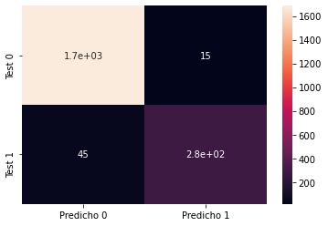
    


El modelo es capaz de predecir con una precisión (acuracy) en test del 94,9%.
El Recall es del 86,15%, el modelo es capaz de detectar el 86,15% de los clientes que se van.

Hay 15 sobre 1686 falsos negativos, solo un 0,88% de los predichos que se van se quedan en el banco.
Hay 42 sobre 280 falsos positivos, predichos que se quedan y que al final se van, representa un 16,07% de los clientes que se irán.


```python
GB_probs=mejor_pipeline.predict_proba(X_test)
GB_probs= GB_probs[:,1]
GB_auc=roc_auc_score(y_test,GB_probs)
GB_fpr, GB_tpr, _ = roc_curve(y_test, GB_probs)

plt.plot(GB_fpr, GB_tpr, color='darkorange' , label="Gradient Boosting(AUROC = %0.3f)" %GB_auc)
lw = 2
plt.plot([0, 1], [0, 1], color='navy', lw=lw, linestyle='--')
plt.xlim([0.0, 1.0])
plt.ylim([0.0, 1.05])
#Title
plt.title("ROC Plot")
#Axis labels
plt.xlabel("False Positive Rate")
plt.ylabel("True Positive Rate")
#Legend
plt.legend()
#show Plot
plt.show()
```


    
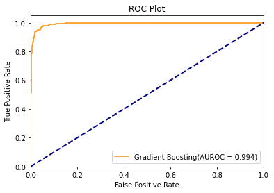
    


El gráfico del área ROC nos muestra que el modelo es capaz de clasificar los clientes con un ajuste del 99,4%

```python

```
